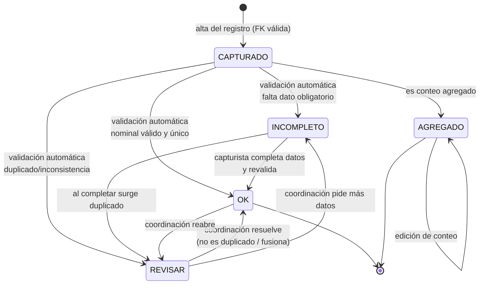

# 01 · SRS — Especificación de Requisitos de Software

| | |
|---|---|
| **Proyecto** | Sistema MEL — Plataforma de Monitoreo, Evaluación y Aprendizaje |
| **Organización** | Comunidad Participa Juárez (CPJ) · Ciudad Juárez, Chihuahua |
| **Documento** | 01 — Especificación de Requisitos de Software |
| **Versión** | 1.0 |
| **Fecha** | 22 de junio de 2026 |
| **Estándar** | ISO/IEC/IEEE 29148:2018 |
| **Autor técnico** | Coordinación MEL · Plan Juárez |
| **Depende de** | [README](../README.md), [ADR-001](../02-arquitectura/ADR/ADR-001_stack-ci4-react-mysql.md)…[ADR-005](../02-arquitectura/ADR/ADR-005_evidencias-enlace-drive.md) |

---

## 1. Introducción

### 1.1 Propósito

Este documento especifica, de forma verificable, **qué debe hacer** el Sistema MEL de CPJ: la cadena de captura programación→ejecución→participación→persona, la herencia estratégica, la deduplicación de personas, el seguimiento de metas POA, los subsistemas verticales (incidencia, shelter, sostenibilidad) y la gobernanza (roles, auditoría, solicitudes). Sirve a quien desarrolla la plataforma, a coordinación MEL como dueña del producto y a quien audite la trazabilidad de los indicadores. Garantiza que la plataforma reproduzca la lógica buena del sistema en Excel v1.9 sin heredar su deuda técnica.

### 1.2 Alcance del MVP

El MVP cubre el **sistema completo de extremo a extremo**, entregado en cuatro fases (ver [Roadmap](../07-roadmap/07_roadmap_sprints.md)):

- **Núcleo MEL** — cadena referencial, catálogos, herencia estratégica, deduplicación, cola de revisión.
- **Metas / POA** — metas anuales y mensuales (M01–M18) por actividad con semáforo.
- **Productos y entregables** — rama tipo E (sin participantes) y casos excepcionales A–D.
- **Incidencia** — propuestas, procesos, compromisos, alianzas, hitos.
- **Verticales** — ocupación de shelter y sostenibilidad financiera.
- **Resultados (tipo R / Fase 3 del sistema actual)** — modelado e implementado en la última fase.
- **Gobernanza** — autenticación (Shield), RBAC, segmentación por institución, auditoría automática, solicitudes, tableros con KPIs reales y conector BI.

**Explícitamente fuera del MVP:**

- Captura **offline / en campo sin internet** (confirmado: la captura siempre ocurre en línea).
- **Alojamiento de archivos** de evidencia (se conserva el enlace a Drive — [ADR-005](../02-arquitectura/ADR/ADR-005_evidencias-enlace-drive.md)).
- **Reescritura metodológica del MEL** (se respeta el modelo conceptual; no se rediseñan las reglas, se hacen cumplir).
- **App móvil nativa** (la SPA responsiva cubre la captura).
- **Verificación automatizada de identidad de beneficiarios** (son sujetos de datos, no usuarios del sistema).

### 1.3 Definiciones, acrónimos y abreviaturas

| Término | Definición |
|---|---|
| **MEL** | Monitoreo, Evaluación y Aprendizaje. |
| **POA** | Plan Operativo Anual; define las metas por actividad y mes (M01–M18). |
| **CPJ** | Comunidad Participa Juárez (la organización). |
| **FECHAC** | Fundación del Empresariado Chihuahuense; financiador que recibe reportes. |
| **Cadena referencial** | proceso → evento programado → ejecución → participación → persona. Eslabón hijo no existe sin su padre. |
| **Herencia estratégica** | Resolución automática de eje→línea→componente→institución desde la actividad elegida. |
| **Beneficiario único** | `COUNT(DISTINCT id_persona)` sobre personas con `control_registro = OK`. |
| **`id_datosbeneficiario`** | Clave difusa determinista de deduplicación, calculada en servidor. |
| **Participación nominal** | 1 fila = 1 persona identificable; alimenta beneficiarios únicos. |
| **Participación agregada** | 1 fila = un conteo no nominal por periodo; **no** cuenta personas únicas. |
| **Tipo de registro (P/E/R)** | Clasificación de actividad: Participación / Entregable / Resultado. |
| **Casos A–D** | Registros excepcionales (sesiones psicológicas, seguimientos, vinculación/conclusión de certificación) que no siguen el flujo normal. |
| **`control_registro`** | Semáforo de calidad por fila: OK / INCOMPLETO / REVISAR / AGREGADO. |
| **Semáforo de metas** | 🟢 ≥90% · 🟡 75–89% · 🔴 <75% · □ sin meta · "Fase 3" (tipo R). |
| **Ámbito** | Conjunto de instituciones/territorios que un usuario puede ver/editar. |
| **RBAC** | Control de acceso basado en roles. |
| **SPA** | Single-Page Application (la app React). |
| **Shield** | Biblioteca oficial de autenticación de CodeIgniter. |

### 1.4 Stack tecnológico de referencia

| Capa | Tecnología | Versión |
|---|---|---|
| Backend | CodeIgniter (API REST) | 4.7.x |
| Lenguaje | PHP | 8.3+ |
| Frontend | React + Vite + TypeScript | React 19 · Vite 6 |
| Base de datos | MySQL | 8.0+ |
| Autenticación | CodeIgniter Shield | 1.x |
| Caché/cola | Redis | — |
| Despliegue | VPS Linux + Nginx | — |

> El stack se decidió en [ADR-001](../02-arquitectura/ADR/ADR-001_stack-ci4-react-mysql.md), que sustituye la recomendación previa de Supabase/PostgreSQL del estudio de viabilidad por un stack 100% autoalojado.

---

## 2. Descripción general

### 2.1 Perspectiva del producto

El Sistema MEL es una aplicación cliente-servidor desacoplada: una SPA de React consume una API REST JSON de CodeIgniter 4. **MySQL es la única fuente de verdad**; no hay servicios externos de dominio. La autenticación es autoalojada con Shield. Las evidencias son enlaces a Google Drive (la plataforma no aloja archivos). La integridad de la cadena MEL se garantiza con claves foráneas reales; la autorización (por rol y por institución) y la deduplicación viven en la capa de servicios del backend. Los resúmenes y tableros que en Excel eran hojas con fórmulas se vuelven **vistas calculadas en vivo**, lo que elimina por construcción los KPIs inflados.

### 2.2 Roles de usuario

| Rol | Descripción | Privilegios clave |
|---|---|---|
| **Capturista** | Registra el día a día dentro de su institución/territorio. | Crear/editar procesos, eventos, ejecuciones, participaciones, productos; registrar solicitudes. Acotado a su ámbito. |
| **Coordinación MEL** | Garantiza calidad y trazabilidad. | Todo lo del capturista + validar, resolver duplicados, reclasificar P/E/R, gestionar metas y catálogos, resolver solicitudes, ver auditoría. Ámbito global. |
| **Dirección** | Consume indicadores confiables. | Solo lectura de dashboards ejecutivos y reportes. No edita datos operativos. Ámbito global. |
| **Administrador** | Gestión técnica. | Gestión de usuarios y configuración. No necesariamente captura. |

> Un usuario tiene **exactamente un rol** (RF-002). El ámbito (instituciones/territorios) es independiente del rol y se define en `usuario_institucion`; el capturista está siempre acotado, los demás roles pueden ser globales según política.

### 2.3 Suposiciones y dependencias

- La captura ocurre **siempre con conexión estable** (no se diseña modo offline).
- Existe un **Google Drive institucional** con permisos adecuados donde viven las evidencias.
- El VPS provee Nginx, PHP-FPM 8.3, MySQL 8, Redis y certificado TLS.
- La migración parte del **Excel v1.9 real** (corte 5-jun-2026); las cifras de conciliación son la línea base.
- Las reglas metodológicas (casos A–D, separación P/E, semáforo) se toman como dadas; CPJ las valida, no se rediseñan.
- El conteo oficial de actividades es **236** (174 P / 42 E / 20 R); el "234" del manual se concilia en migración.

---

## 3. Requisitos funcionales

Formato: `RF-[MÓDULO]-[n]`. Cada requisito referencia las reglas de negocio `RN-xxx` definidas operativamente en el análisis de origen y reflejadas en el [Modelo de Datos](../03-datos/03_modelo_de_datos.md) y el [Plan de Seguridad](../04-seguridad/04_plan_de_seguridad.md).

### 3.1 Autenticación y sesión

**RF-AUTH-001** — Autenticación por cuenta individual.
El sistema autentica a cada usuario con cuenta individual mediante CodeIgniter Shield; no existen contraseñas compartidas.
**Criterio de aceptación:** un usuario inválido o sin token recibe 401; un login válido emite un access token usable en `Authorization: Bearer`.

**RF-AUTH-002** — Un rol por usuario.
Cada usuario pertenece a exactamente un grupo: `capturista`, `coordinacion`, `direccion` o `administrador`.
**Criterio:** el sistema rechaza asignar dos roles simultáneos al mismo usuario.

**RF-AUTH-003** — Aplicación de permisos del lado servidor.
El backend aplica la matriz de permisos (doc 06/04) en cada acción, no solo ocultando botones en la UI.
**Criterio:** una petición a un endpoint no permitido para el rol devuelve 403 aunque la UI lo hubiese ofrecido.

**RF-AUTH-004** — Segmentación por institución/territorio.
El sistema limita lo que un capturista ve y edita a su ámbito (`usuario_institucion`).
**Criterio:** un capturista que solicita un registro de otra institución recibe 403/404; un listado solo devuelve registros de su ámbito.

**RF-AUTH-005** — Revocación y cierre de sesión.
El sistema permite cerrar sesión y revocar el access token.
**Criterio:** tras revocar, el token deja de autenticar (401).

### 3.2 Catálogos y herencia estratégica

**RF-CAT-010** — Gestión de catálogos.
Coordinación/admin puede crear y editar ejes, líneas, componentes, instituciones y actividades.
**Criterio:** un capturista no puede crear ni editar catálogos (403).

**RF-CAT-011** — Herencia en solo lectura.
Al elegir una actividad, el sistema muestra eje/línea/componente/institución heredados en solo lectura (RN-010).
**Criterio:** el formulario nunca pide capturar el eje; los valores heredados coinciden con los de la actividad.

**RF-CAT-012** — Clasificación de actividad.
Cada actividad tiene `tipo_registro` (P/E/R) y, si aplica, `caso_excepcional` (A/B/C/D).
**Criterio:** toda actividad del catálogo tiene un `tipo_registro` válido; las 236 se distribuyen 174 P / 42 E / 20 R.

**RF-CAT-013** — Reclasificación controlada.
Solo coordinación puede cambiar `tipo_registro`; el cambio queda en `solicitudes` y `auditoria` (RN-023).
**Criterio:** un intento de reclasificación por un capturista devuelve 403; un cambio por coordinación genera un registro en `auditoria`.

### 3.3 Procesos y programación

**RF-PROG-020** — Alta de proceso.
El usuario puede crear un proceso con tipo SESION_UNICA / MULTI_SESION_PROGRAMADA / PROCESO_CONTINUO.
**Criterio:** se puede listar y editar el proceso creado dentro del ámbito del usuario.

**RF-PROG-021** — Proceso obligatorio en multisesión.
Si el tipo no es SESION_UNICA, el sistema exige un proceso válido al programar (RN-030).
**Criterio:** programar un evento MULTI_SESION sin proceso devuelve error de validación.

**RF-PROG-022** — Validación de fechas.
El sistema rechaza eventos con `fecha_finalizacion < fecha_inicio` (RN-049).
**Criterio:** el alta con fechas invertidas devuelve 422.

**RF-PROG-023** — Calendario filtrable.
El calendario muestra el universo programado, filtrable por actividad, institución, responsable, periodo y estatus (respetando el ámbito).
**Criterio:** los filtros devuelven exactamente los eventos que cumplen los criterios y el ámbito.

### 3.4 Ejecuciones

**RF-EJEC-030** — Ejecución vinculada a evento.
Solo se puede crear una ejecución vinculada a un evento programado existente (RN-001).
**Criterio:** intentar crear una ejecución con `id_evento_programado` inexistente devuelve 422; es imposible crear una ejecución huérfana.

**RF-EJEC-031** — Datos para validar.
El sistema exige fecha real, estatus, resumen narrativo sustantivo y evidencia para que la ejecución alcance `control_registro = OK` (RN-050/051).
**Criterio:** sin alguno de esos datos, el registro queda INCOMPLETO; un resumen vacío o genérico no valida.

**RF-EJEC-032** — Bloqueo de tipo E en ejecuciones.
El formulario de ejecución no ofrece actividades tipo E (RN-021).
**Criterio:** la lista de actividades para ejecución excluye las 42 actividades tipo E.

**RF-EJEC-033** — Tipo de participación.
El sistema permite marcar el tipo de registro de participación: Nominal / Agregado / Mixta.
**Criterio:** una ejecución mixta admite participaciones nominales y agregadas a la vez.

### 3.5 Participación y personas

**RF-PART-040** — Participación vinculada a ejecución.
Solo se puede crear una participación vinculada a una ejecución existente (RN-002).
**Criterio:** una participación sin ejecución válida es imposible (422).

**RF-PART-041** — Cálculo de clave de dedup.
El sistema calcula `id_datosbeneficiario` al guardar, con normalización de acentos y espacios (RN-060/061).
**Criterio:** "José Pérez" y "Jose Perez" con los mismos datos producen la misma clave.

**RF-PART-042** — Asignación de `id_persona`.
El sistema asigna `id_persona` por coincidencia de clave y marca duplicados sospechosos (RN-062/063).
**Criterio:** dos participaciones con la misma clave comparten `id_persona`; una clave nueva crea `PER_#####`.

**RF-PART-043** — Cola de revisión.
Los posibles duplicados entran a una cola con decisión trazable de coordinación (RN-063/065).
**Criterio:** un duplicado sospechoso aparece en la cola con `control_registro = REVISAR`; la fusión queda en `auditoria`.

**RF-PART-044** — Sin alta manual de personas.
No existe formulario de alta manual de personas (RN-066).
**Criterio:** no hay endpoint `POST /personas`; `personas` solo se puebla desde participaciones.

**RF-PART-045** — Validación de campos de persona.
El sistema valida los campos obligatorios y clasifica el registro (OK/INCOMPLETO/REVISAR) según las reglas de validación (RN-040…047).
**Criterio:** una participación sin apellido paterno, sexo, teléfono o colonia queda INCOMPLETO.

**RF-PART-046** — Año de nacimiento.
`anio_nacimiento` se captura como año entero (≈1900–año actual), nunca fecha completa (RN-046).
**Criterio:** el campo rechaza fechas; acepta solo años en rango.

### 3.6 Participación agregada y casos A–D

**RF-AGRE-050** — Conteo agregado.
El usuario puede registrar conteos agregados con sexo_grupo, grupo_edad, cantidad, motivo, fuente y `periodo_corte`.
**Criterio:** un conteo agregado se guarda con `control_registro = AGREGADO`.

**RF-AGRE-051** — `periodo_corte` obligatorio en A/B.
Para actividades de caso A/B, el sistema exige `periodo_corte` antes de guardar (RN-081/082).
**Criterio:** guardar un caso A/B sin `periodo_corte` devuelve 422.

**RF-AGRE-052** — Agregadas no son personas.
Las participaciones agregadas no se cuentan como beneficiarios únicos (RN-070).
**Criterio:** el indicador de beneficiarios únicos ignora las agregadas.

**RF-AGRE-053** — Casos C/D sin falso rezago.
Para casos C/D, el tablero no marca rezago en meses intermedios (RN-085).
**Criterio:** una actividad C con avance 0 en meses intermedios no se pinta roja.

### 3.7 Productos y entregables (tipo E)

**RF-PROD-060** — Solo actividades E.
El formulario de productos solo ofrece actividades tipo E (RN-020).
**Criterio:** intentar crear un producto sobre una actividad P devuelve 422.

**RF-PROD-061** — Herencia en productos.
El sistema hereda la estructura estratégica al elegir la actividad.
**Criterio:** el producto muestra eje/línea/componente/institución heredados.

**RF-PROD-062** — Validación de producto.
`control_registro = OK` cuando nombre, estatus y evidencia están completos.
**Criterio:** sin evidencia válida, el producto queda INCOMPLETO.

### 3.8 Metas y seguimiento

**RF-META-070** — Gestión de metas.
Coordinación captura metas anuales y mensuales (M01–M18) por actividad.
**Criterio:** un capturista no puede editar metas (403).

**RF-META-071** — Avance y semáforo en vivo.
El sistema calcula el avance real en vivo y el semáforo por los umbrales 90/75 (sección 2.9 del glosario).
**Criterio:** el avance se recalcula al cambiar datos operativos; el semáforo respeta los umbrales.

**RF-META-072** — Rezago real vs. corte.
El tablero de metas distingue rezago real del corte al cierre (casos C/D).
**Criterio:** las actividades C/D muestran "corte al cierre", no rojo, en meses intermedios.

### 3.9 Incidencia

**RF-INC-080** — Captura de incidencia.
El usuario puede registrar propuestas, procesos, compromisos, alianzas e hitos de incidencia.
**Criterio:** cada entidad se crea y se lista dentro del ámbito.

**RF-INC-081** — Dependencia de proceso.
Compromisos e hitos requieren un proceso de incidencia válido (RN-004).
**Criterio:** un compromiso sin proceso válido es imposible (422).

### 3.10 Verticales

**RF-VERT-090** — Ocupación shelter.
El usuario puede registrar ocupación por tipo de espacio y mes; el sistema calcula el % de ocupación.
**Criterio:** el % de ocupación = ocupación/capacidad instalada por tipo de espacio y mes.

**RF-VERT-091** — Sostenibilidad financiera.
El usuario registra ingresos/costos/recursos por actividad y mes; el sistema calcula utilidad, acumulados, % de avance y semáforo.
**Criterio:** utilidad neta, recursos totales y acumulados anuales se calculan correctamente; el semáforo refleja el avance vs. meta anual.

### 3.11 Resultados (tipo R)

**RF-RES-100** — Registro de resultados.
El sistema permite registrar resultados (indicador, línea base, valor medido, método, evidencia) para actividades tipo R.
**Criterio:** una actividad R admite un resultado con sus campos; el semáforo deja de marcarla "Fase 3 pendiente".

### 3.12 Gobernanza

**RF-GOB-110** — Solicitudes.
Cualquier usuario puede registrar una solicitud de corrección/mejora.
**Criterio:** la solicitud se guarda con estado inicial "en revisión".

**RF-GOB-111** — Resolución de solicitudes.
Coordinación puede cambiar el estado de cada solicitud y asignar responsable.
**Criterio:** el cambio de estado queda registrado con responsable y fecha.

**RF-GOB-112** — Auditoría automática.
El sistema registra automáticamente cada cambio de escritura en `auditoria` (quién/qué/cuándo/antes/después) (RN-105).
**Criterio:** toda operación de escritura genera un registro inmutable en `auditoria`.

**RF-GOB-113** — Nombre normalizado de evidencia.
El sistema puede generar el nombre normalizado de evidencia (RN-113).
**Criterio:** el nombre sigue la convención `CPJ_EVID_[fecha]_[id_evento]_[actividad]_[consecutivo].[ext]`.

### 3.13 Tableros y exportación

**RF-TAB-120** — Tableros con KPIs reales.
El sistema presenta los tableros operativo, coordinación, ejecutivo, analítico y shelter con KPIs calculados sobre datos reales.
**Criterio:** ningún tablero reporta filas-plantilla; los conteos cuadran con la línea base de conciliación.

**RF-TAB-121** — Filtros de tablero.
Los tableros son filtrables por periodo, institución, eje y actividad (respetando el ámbito).
**Criterio:** los filtros producen subconjuntos coherentes.

**RF-TAB-122** — Exportación a financiador.
El sistema permite exportar reportes para FECHAC/financiadores (Fase 4).
**Criterio:** la exportación produce el formato y campos acordados.

**RF-TAB-123** — Consumible por BI.
El esquema es consumible por una herramienta BI externa sin transformación adicional.
**Criterio:** Power BI/Tableau se conecta a MySQL y reproduce los indicadores núcleo.

### 3.14 Alertas (fase posterior)

**RF-ALE-130** — Recordatorios de plazo.
El sistema puede generar recordatorios de los plazos día-20 y lunes-siguiente (RN-100/101).
**Criterio:** se emite recordatorio por correo/in-app en las fechas configuradas.

---

## 4. Máquina de estados del flujo principal (validación del registro operativo)

El corazón del control de calidad es el ciclo de vida de `control_registro` de un registro operativo (ejecución o participación). Aquí se materializa el principio "el sistema previene, no corrige después": la validación automática propone un estado y coordinación puede prevalecer.

### 4.1 Tabla de transiciones

| Estado origen | Condición de transición | Estado destino | Actor responsable |
|---|---|---|---|
| (alta) | Se crea el registro con FK de cadena válida | CAPTURADO | Capturista |
| CAPTURADO | Falta un campo obligatorio (RN-040…047) | INCOMPLETO | Sistema (automático) |
| CAPTURADO | Clave de dedup sospechosa / teléfono compartido (RN-044/063) | REVISAR | Sistema (automático) |
| CAPTURADO | Nominal, completo y único | OK | Sistema (automático) |
| CAPTURADO | Registro de conteo agregado | AGREGADO | Sistema (automático) |
| INCOMPLETO | El capturista completa los datos y revalida | OK | Capturista → Sistema |
| INCOMPLETO | Al completar, se detecta posible duplicado | REVISAR | Sistema |
| REVISAR | Coordinación decide que no es duplicado, o fusiona | OK | Coordinación |
| REVISAR | Coordinación determina que faltan datos | INCOMPLETO | Coordinación |
| OK | Coordinación reabre por inconsistencia detectada | REVISAR | Coordinación |
| AGREGADO | Edición del conteo agregado | AGREGADO | Capturista/Coordinación |

### 4.2 Reglas invariantes

- **Solo `OK` cuenta en indicadores** (beneficiarios únicos, cumplimiento, semáforo). `AGREGADO` cuenta en cobertura, nunca en personas únicas. `INCOMPLETO`/`REVISAR` no cuentan.
- **`decision_coordinacion` prevalece sobre `control_automatico`** (RN-090): un humano puede sobrescribir la propuesta del sistema, y eso queda en `auditoria`.
- Un capturista **no** puede mover un registro a `OK` desde `REVISAR` (eso es decisión de coordinación); sí puede pasar de `INCOMPLETO` a `OK` al completar datos válidos.
- Ninguna transición puede ocurrir si rompe la cadena referencial (no se puede dejar una participación sin ejecución).
- Toda transición se audita.

> Esta máquina de estados se refleja en: el diagrama de secuencia de validación de [Arquitectura §4](../02-arquitectura/02_arquitectura_sistema.md), los endpoints de transición de [API §7](../05-api/05_especificacion_api.md) y la tabla exhaustiva de casos de [Pruebas §2](../06-pruebas/06_plan_de_pruebas.md).

### 4.3 Estado del evento programado (máquina secundaria)

Complementa a la principal: `programado → ejecutado | cancelado | reprogramado`. Una ejecución solo puede crearse sobre un evento `programado`/`reprogramado`; un evento `cancelado` no admite ejecución. Las cancelaciones/cambios se notifican al responsable MEL (RN-102) y actualizan el estatus.

---

## 5. Requisitos no funcionales

| ID | Categoría | Requisito | Criterio medible |
|---|---|---|---|
| RNF-001 | Integridad | FK reales garantizan que no existan huérfanos en la cadena MEL. | Imposible insertar ejecución/participación sin padre (probado en doc 06). |
| RNF-002 | Integridad | Restricciones de dominio (rangos, enums, obligatoriedad) en la base, no solo en el formulario. | `CHECK`/enum en MySQL rechazan valores fuera de dominio. |
| RNF-003 | Integridad | No existen filas-plantilla; una fila existe solo con datos reales. | Conteos = registros reales; conciliación cuadra con la línea base. |
| RNF-010 | Seguridad | Autenticación por cuenta individual; sin contraseñas compartidas. | Login por Shield; cero credenciales compartidas. |
| RNF-011 | Seguridad | Permisos por rol y por institución aplicados del lado servidor. | 403 ante acción/recurso fuera de rol o ámbito. |
| RNF-012 | Seguridad/Privacidad | PII de beneficiarios tratada como sensible; acceso restringido por rol e institución. | Un capturista no lee PII de otra institución. |
| RNF-013 | Seguridad | Conexiones cifradas (HTTPS/TLS) forzadas. | HTTP redirige a HTTPS; HSTS activo. |
| RNF-020 | Auditoría | Todo cambio de escritura se registra automáticamente. | Cada escritura produce un registro en `auditoria`. |
| RNF-021 | Auditoría | Historial consultable por coordinación/admin; inmutable para el resto. | No hay endpoint de borrado de `auditoria`. |
| RNF-030 | Usabilidad | La UI de captura es más simple que el Excel (menos columnas; herencia oculta). | El capturista no ve campos heredados ni IDs técnicos. |
| RNF-031 | Usabilidad | Validación en el momento, con mensaje claro y accionable. | El error se muestra al capturar, no después. |
| RNF-033 | Usabilidad | Listas desplegables para todo campo de catálogo; nunca texto libre donde haya catálogo. | Campos de catálogo son `select`, validados contra la tabla. |
| RNF-034 | Usabilidad | Idioma español; etiquetas alineadas al vocabulario de los manuales. | Terminología MEL consistente con los manuales. |
| RNF-040 | Escalabilidad | Soporta crecimiento más allá del techo de 1000 filas del Excel. | Miles de participaciones/año sin degradación funcional. |
| RNF-041 | Rendimiento | Tableros responden en tiempo interactivo sobre el volumen esperado. | p95 < 2 s para tableros con datos de un año. |
| RNF-042 | Escalabilidad | Multiusuario concurrente sin bloqueos de archivo ni copias manuales. | Varias sesiones simultáneas sin conflicto. |
| RNF-050 | Disponibilidad | Respaldo periódico automático de la base. | Respaldo diario verificable. |
| RNF-051 | Disponibilidad | Capacidad de restaurar a un punto anterior. | Restauración probada en staging. |
| RNF-060 | Mantenibilidad | Esquema versionado con migraciones controladas. | Migraciones reproducibles desde cero. |
| RNF-062 | Portabilidad | Datos exportables a CSV; sin dependencia de funciones propietarias de hoja de cálculo. | Export CSV de cualquier entidad. |
| RNF-070 | Calidad de datos | La migración resuelve duplicados, `#REF!` y descuadre 236/234. | Conciliación pasa los umbrales de la línea base. |

---

## 6. Restricciones técnicas

1. **Stack fijo** (ADR-001): CodeIgniter 4.7 + React/Vite + MySQL 8 + Redis. No se introduce otro framework ni motor.
2. **Autoalojamiento total** en VPS de CPJ; sin dependencia de proveedores externos de identidad o datos (sí Drive para enlaces de evidencia).
3. **Sin RLS nativa**: el filtrado por institución se implementa en la capa de aplicación (ADR-004) y es obligatorio en cada query.
4. **Ley aplicable**: LFPDPPP (México) para el tratamiento de datos personales de beneficiarios.
5. **Captura siempre en línea**: no se construye modo offline.
6. **Evidencias por enlace**: la plataforma no aloja archivos (ADR-005).
7. **Idioma**: español en toda la interfaz y la terminología.

---

## 7. Criterios de aceptación del MVP

El MVP se considera terminado y lanzable cuando:

1. Un usuario se autentica con cuenta individual (Shield) y solo accede a lo permitido por su rol y ámbito.
2. Se puede capturar la cadena completa proceso→evento→ejecución→participación, con herencia estratégica visible en solo lectura.
3. Es **imposible** crear registros huérfanos o un producto sobre una actividad no-E (probado).
4. La deduplicación asigna `id_persona` de forma determinista y envía los sospechosos a la cola de revisión; coordinación los resuelve con traza.
5. Los datos del Excel v1.9 están migrados y la conciliación cuadra con la línea base (≈988 participaciones, ≈762 personas únicas, ≈279 eventos, ≈132 ejecuciones, 236 actividades).
6. Las metas POA muestran avance y semáforo en vivo, con la lógica de casos C/D.
7. Los tableros muestran KPIs reales; ninguno reporta 1000/100%.
8. Incidencia y verticales (shelter, sostenibilidad) capturan y reportan.
9. La capa de resultados (tipo R) permite registrar resultados.
10. Toda escritura queda auditada; las solicitudes se registran y resuelven con traza.
11. Pruebas de seguridad (IDOR entre instituciones, escalada de rol, token inválido/revocado, inyección, mass-assignment) pasan.

---

## 8. Consideraciones futuras (fuera del MVP)

- App móvil nativa y/o captura offline (PWA) si la operación en campo lo exige.
- Alojamiento de archivos de evidencia en la plataforma (si se decide dejar de depender de Drive).
- *Fuzzy matching* avanzado de personas (más allá de la clave determinista + similitud).
- Verificación de identidad de beneficiarios.
- Alertas automáticas avanzadas (escalado, recordatorios configurables por rol).
- Reportes parametrizables por financiador más allá de FECHAC.
- Estructuración del "Aprendizaje" (lecciones) como dato, no solo narrativa.
