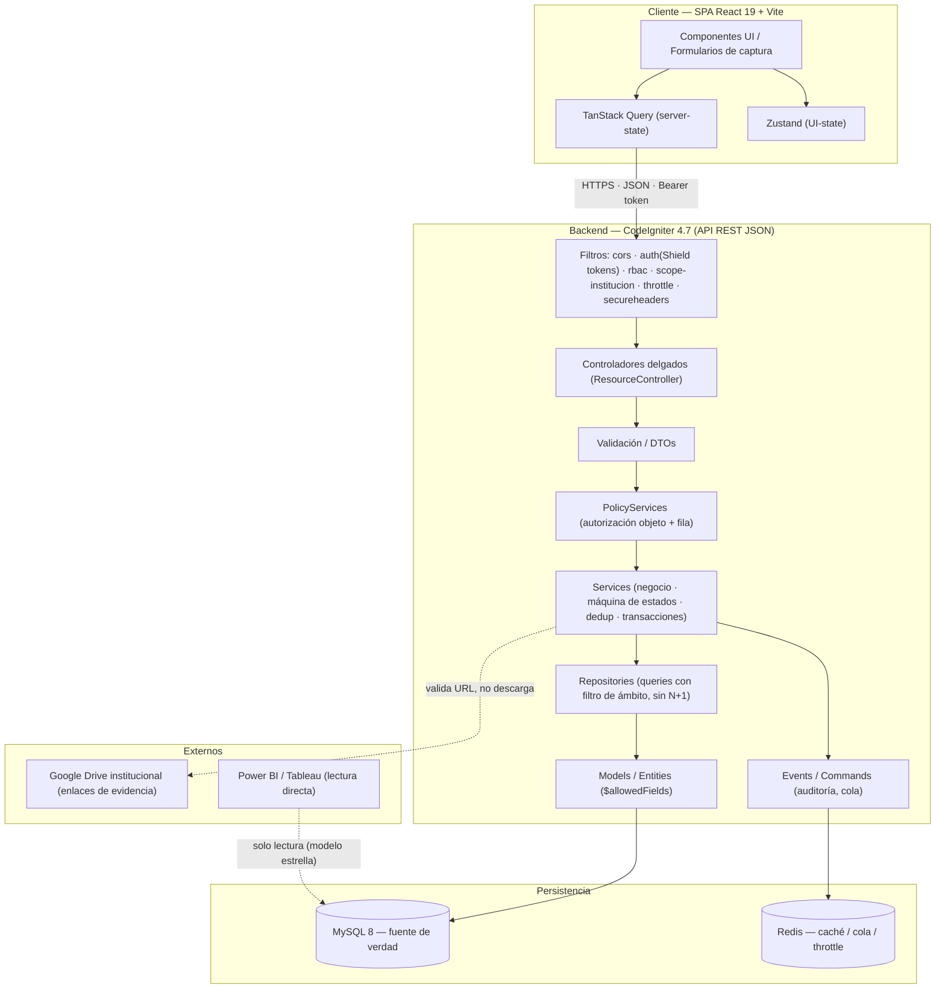
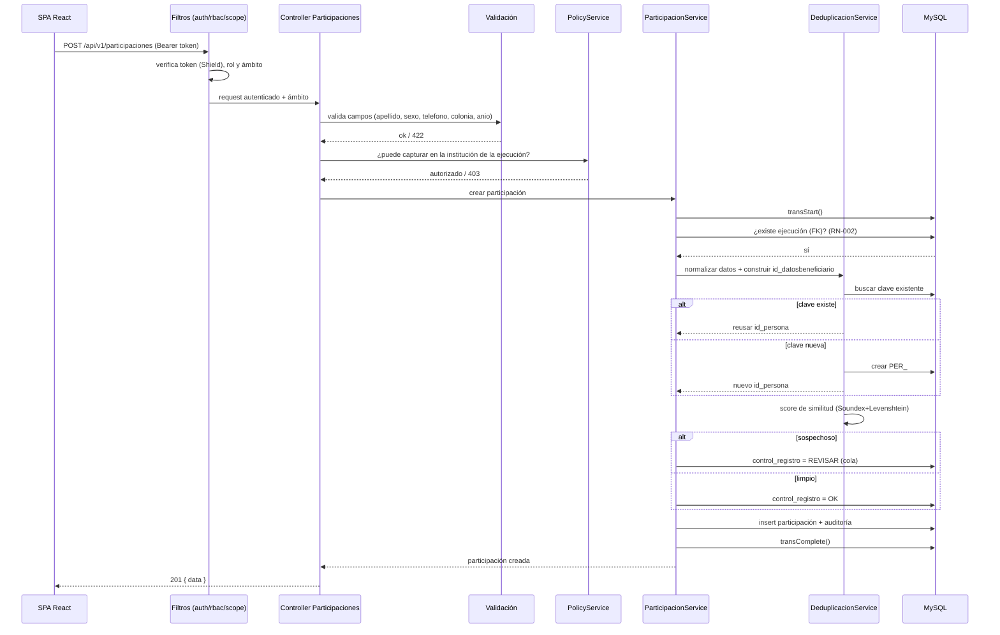
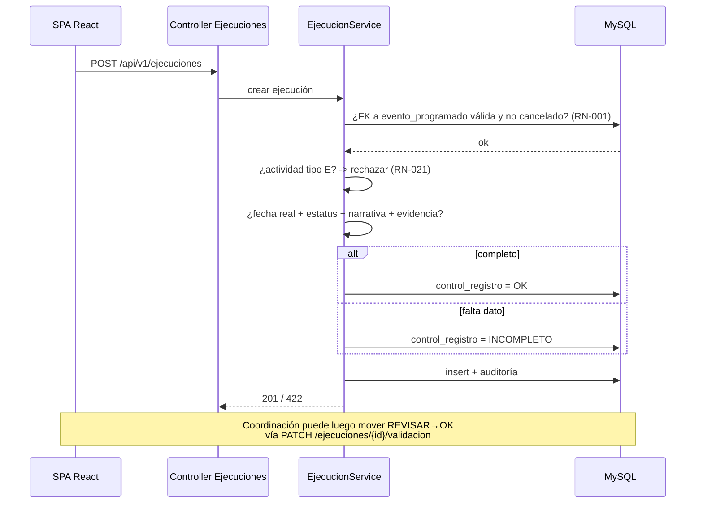
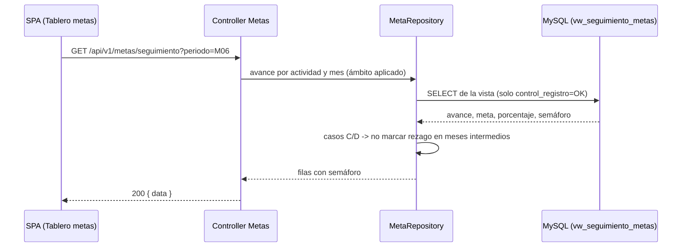
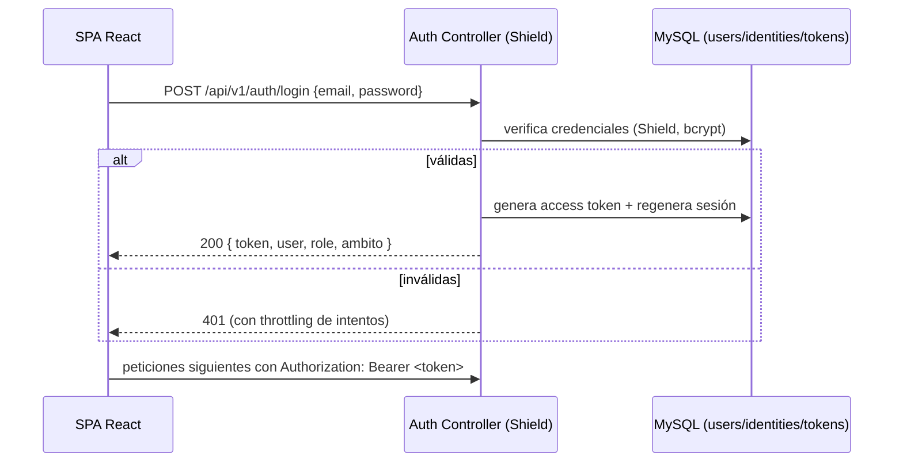
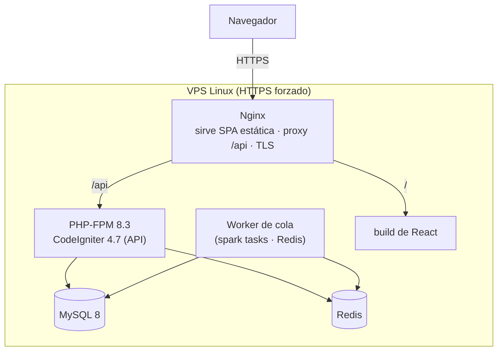

# 02 · Arquitectura del Sistema

| | |
|---|---|
| **Documento** | 02 — Arquitectura del Sistema |
| **Versión** | 1.0 |
| **Fecha** | 22 de junio de 2026 |
| **Depende de** | [SRS (01)](../01-vision/01_SRS_especificacion_requisitos.md), [ADR-001](ADR/ADR-001_stack-ci4-react-mysql.md), [ADR-002](ADR/ADR-002_autenticacion-shield.md), [ADR-003](ADR/ADR-003_deduplicacion-sin-postgres.md), [ADR-004](ADR/ADR-004_segmentacion-institucion.md), [ADR-005](ADR/ADR-005_evidencias-enlace-drive.md) |

---

## 1. Principios rectores

**El cliente nunca es de fiar.** Toda regla de negocio, validación de cadena y decisión de autorización viven en el backend CI4. La SPA es una capa de experiencia: puede ocultar un botón, pero la frontera de seguridad real es el servidor. *No negociable* porque el frontend corre en la máquina del usuario y es manipulable; replicar la validación en el cliente es UX, no seguridad.

**Una sola fuente de verdad: MySQL.** No hay servicios externos de dominio. La integridad referencial, la autorización y los conteos se resuelven contra MySQL. *No negociable* porque el fallo raíz del Excel fue distribuir la lógica en un motor que no la garantizaba; aquí un único motor es responsable y auditable.

**Integridad por construcción, no por disciplina.** La cadena referencial se sostiene con FK reales y `ON DELETE RESTRICT`; las restricciones de dominio (enums, rangos) viven en la base. *No negociable* porque el sistema debe hacer imposible el error estructural (huérfanos, KPIs inflados), no confiar en que el usuario lo evite.

**Prevenir, no corregir después.** La validación ocurre al capturar; el formulario impide elegir una actividad tipo E en una ejecución, exige `periodo_corte` en casos A/B, y calcula la deduplicación en el momento. *No negociable* porque "devolver a corrección" es justamente el costo operativo que la plataforma elimina.

**Autorización centralizada y de denegación por defecto.** El filtrado por institución/territorio se aplica en una sola capa (Repository/Policy) para que ninguna consulta pueda omitirlo. *No negociable* porque MySQL no tiene RLS y la fuga horizontal de PII entre instituciones es el riesgo más grave del modelo de datos.

---

## 2. Estilo arquitectónico

**Cliente-servidor desacoplado (SPA + API REST), backend en monolito modular por capas.** La SPA React/Vite y la API CI4 son despliegues separados que se comunican por JSON sobre HTTPS. El backend es un **monolito modular**: un solo proceso CI4 organizado en capas y módulos (núcleo, metas, productos, incidencia, verticales, gobernanza), no microservicios.

La justificación es económica y operativa: el sistema lo opera una organización pequeña, lo desarrolla un equipo reducido y el volumen es de miles de registros al año, no millones. Microservicios añadirían complejidad de despliegue, observabilidad y consistencia distribuida sin beneficio real. El monolito modular da fronteras de código claras (carpetas por módulo, servicios por dominio) con un único proceso fácil de desplegar y respaldar. El desacople SPA↔API permite, sin embargo, evolucionar el frontend de forma independiente y conectar BI directo a MySQL.

### 2.1 Diagrama de capas



---

## 3. Descripción de capas

### 3.1 Capa de presentación / cliente (React 19 + Vite)
- **Responsabilidad:** formularios de captura guiados, tableros, cola de revisión, gestión de catálogos/metas (según rol). Estado de servidor con TanStack Query (caché, reintentos, invalidación); estado de UI con Zustand.
- **Reglas de diseño:** auto-escape de React; `dangerouslySetInnerHTML` prohibido salvo DOMPurify. El access token se mantiene en memoria, no en `localStorage`. Las listas de catálogo se pueblan desde la API (nunca hardcodeadas). Validación de UX espejo de la del backend, pero **no** es la fuente de verdad.
- **Lo que NO debe hacer:** decidir permisos, calcular indicadores oficiales, ni asumir que un campo oculto está protegido.

### 3.2 Filtros / Middlewares
- **Responsabilidad:** `cors` (orígenes permitidos), `auth` (Shield `tokens`/`chain`, verifica el access token), `rbac` (grupo de Shield requerido por ruta), `scope-institucion` (carga el ámbito del usuario al request), `throttle` (rate limit por IP/usuario), `secureheaders` (cabeceras de seguridad).
- **Reglas:** corren **antes** del controlador, en orden; `auth` precede a todo `/api` salvo `login`/`health`. Denegación por defecto.
- **Lo que NO debe hacer:** lógica de negocio.

### 3.3 Controladores
- **Responsabilidad:** traducir HTTP↔dominio. Reciben el request, delegan a Validación→Policy→Service, devuelven la respuesta con el código correcto. `ResourceController` para CRUD; controladores normales para transiciones y acciones.
- **Reglas:** **delgados**; sin SQL, sin reglas de negocio. Usan el trait `ApiResponder` para el envoltorio estándar.
- **Lo que NO debe hacer:** consultar la base directamente ni decidir autorización fina.

### 3.4 Validación y DTOs
- **Responsabilidad:** validar forma y dominio de la entrada (tipos, rangos, obligatoriedad, `valid_url_strict` para evidencias) antes de tocar la base.
- **Reglas:** reglas declarativas de CI4; los DTOs definen exactamente qué campos entran (refuerzo anti mass-assignment junto con `$allowedFields`).
- **Lo que NO debe hacer:** consultar reglas que dependan del estado de la base (eso es del Service).

### 3.5 Servicios de autorización (PolicyServices)
- **Responsabilidad:** decidir si el usuario puede actuar sobre **este objeto**: combina grupo de Shield + ámbito de institución del objeto vs. del usuario. Es donde vive la regla de segmentación (ADR-004).
- **Reglas:** denegación por defecto; toda acción sensible pasa por una policy. Devuelven autorizado/denegado, no datos.
- **Lo que NO debe hacer:** mutar datos.

### 3.6 Servicios de negocio (Services)
- **Responsabilidad:** orquestar la lógica: validar la cadena referencial y la máquina de estados, calcular la deduplicación (`DeduplicacionService`), recalcular metas, envolver operaciones multi-tabla en transacciones, emitir eventos de auditoría.
- **Reglas:** toda escritura multi-tabla en `transStart()/transComplete()`; la transición de `control_registro` se valida aquí antes de persistir; la dedup se ejecuta dentro de la transacción de alta de participación.
- **Lo que NO debe hacer:** hablar HTTP ni escribir SQL crudo.

### 3.7 Repositories
- **Responsabilidad:** consultas optimizadas con Query Builder; **aplican el filtro de ámbito** (`WHERE id_institucion IN (:ambito)`) en cada lectura/escritura salvo rol global; evitan N+1 con joins/eager-load explícito.
- **Reglas:** es la **única** capa que arma queries; centralizar el filtro de institución aquí lo hace imposible de olvidar.
- **Lo que NO debe hacer:** decisiones de negocio.

### 3.8 Modelos y Entidades
- **Responsabilidad:** mapeo tabla↔objeto, `$allowedFields`, casts, timestamps, callbacks de auditoría.
- **Reglas:** `$allowedFields` nunca incluye `id`, `id_persona`, ni campos de control/estado que calcula el servidor. `$useSoftDeletes` donde aplique para preservar trazabilidad.
- **Lo que NO debe hacer:** queries de reporte complejas (van al Repository) ni autorización.

### 3.9 Cola y trabajos asíncronos
- **Responsabilidad:** correos (notificaciones, recordatorios de plazo), recálculo masivo de deduplicación, refresco de tablas-resumen, exportaciones a financiador.
- **Reglas:** Redis como backend de cola; los trabajos se disparan por `spark` commands o tras un evento. El request HTTP no espera I/O lento.

### 3.10 Eventos y auditoría
- **Responsabilidad:** registrar automáticamente cada escritura en `auditoria` (quién/qué/cuándo/antes/después), append-only.
- **Reglas:** se engancha en callbacks de Model/Service; ninguna escritura de dominio escapa a la auditoría.

---

## 4. Flujos de datos críticos

### 4.1 Alta de participación con deduplicación (el flujo más sensible)



### 4.2 Validación de ejecución (máquina de estados de `control_registro`)



### 4.3 Cálculo de avance de metas (vista en vivo)



### 4.4 Autenticación con Shield (emisión de access token)



---

## 5. Patrones de implementación

> Código representativo en CI4 4.7 / PHP 8.3. Refleja las capas de la sección 3. No es el código final, pero fija el patrón.

### 5.1 Controlador delgado (ResourceController)

```php
<?php
namespace App\Controllers\Api\V1;

use CodeIgniter\RESTful\ResourceController;
use App\Services\ParticipacionService;
use App\Traits\ApiResponder;

class Participaciones extends ResourceController
{
    use ApiResponder;

    protected $format = 'json';

    public function create(): \CodeIgniter\HTTP\ResponseInterface
    {
        $data = $this->request->getJSON(true);

        // 1) Validación de forma/dominio
        if (! $this->validate('participacionCreate')) {
            return $this->error('Datos inválidos', 422, $this->validator->getErrors());
        }

        // 2) Autorización de objeto + ámbito (Policy)
        $policy = service('policy');
        if (! $policy->puedeCapturarEnEjecucion(auth()->user(), (int) $data['id_ejecucion'])) {
            return $this->error('No autorizado para esta institución', 403);
        }

        // 3) Negocio (cadena, dedup, transacción) en el Service
        $service = service(ParticipacionService::class);
        $result  = $service->crear($data, auth()->id());

        return $result->ok
            ? $this->success(['id' => $result->id, 'id_persona' => $result->idPersona, 'control' => $result->control], 201)
            : $this->error($result->message, 422, $result->errors);
    }
}
```

### 5.2 Encadenamiento validación → policy → service

```php
// app/Config/Validation.php  — regla nombrada reutilizable
public array $participacionCreate = [
    'id_ejecucion'     => 'required|is_natural_no_zero',
    'nombres'          => 'required|string|max_length[120]',
    'apellido_paterno' => 'required|string|max_length[80]',
    'apellido_materno' => 'permit_empty|string|max_length[80]',
    'anio_nacimiento'  => 'permit_empty|integer|greater_than[1899]|less_than_equal_to[2026]',
    'sexo'             => 'required|in_list[F,M,X]',
    'telefono'         => 'required|string|max_length[20]',
    'colonia_persona'  => 'required|string|max_length[120]',
];
```

### 5.3 Transacción multi-tabla con máquina de estados y dedup

```php
<?php
namespace App\Services;

use App\Repositories\ParticipacionRepository;
use App\Repositories\EjecucionRepository;

class ParticipacionService
{
    public function __construct(
        private ParticipacionRepository $participaciones,
        private EjecucionRepository $ejecuciones,
        private DeduplicacionService $dedup,
        private AuditoriaService $auditoria,
        private \CodeIgniter\Database\BaseConnection $db,
    ) {}

    public function crear(array $data, int $userId): ResultadoParticipacion
    {
        $this->db->transStart();

        // RN-002: la ejecución debe existir
        $ejecucion = $this->ejecuciones->find((int) $data['id_ejecucion']);
        if ($ejecucion === null) {
            $this->db->transRollback();
            return ResultadoParticipacion::error('La ejecución no existe.');
        }

        // RN-060/061/062: deduplicación determinista en servidor
        $clave    = $this->dedup->construirClave($data);
        $persona  = $this->dedup->asignarPersona($clave, $data); // reusa o crea PER_#####
        $control  = $this->dedup->evaluarControl($clave, $data);  // OK | REVISAR | INCOMPLETO

        $id = $this->participaciones->insertar([
            ...$data,
            'id_persona'           => $persona->id,
            'id_datosbeneficiario' => $clave,
            'control_registro'     => $control,
            'control_automatico'   => $control,
        ]);

        $this->auditoria->registrar($userId, 'participaciones', $id, 'alta', null, $data);

        $this->db->transComplete();

        return $this->db->transStatus()
            ? ResultadoParticipacion::ok($id, $persona->id, $control)
            : ResultadoParticipacion::error('No se pudo guardar la participación.');
    }
}
```

### 5.4 Repository con filtro de ámbito obligatorio (reemplazo de RLS)

```php
<?php
namespace App\Repositories;

class ParticipacionRepository
{
    public function __construct(private \CodeIgniter\Database\BaseConnection $db) {}

    /** Listado SIEMPRE acotado al ámbito de instituciones del usuario (ADR-004). */
    public function listarPorAmbito(array $institucionesPermitidas, array $filtros = []): array
    {
        $builder = $this->db->table('participaciones p')
            ->select('p.id_participacion, p.nombres, p.apellido_paterno, p.control_registro, a.id_institucion')
            ->join('ejecuciones e', 'e.id_ejecucion = p.id_ejecucion')
            ->join('eventos_programados ev', 'ev.id_evento_programado = e.id_evento_programado')
            ->join('actividades a', 'a.id_actividad = ev.id_actividad');

        // Denegación por defecto: sin ámbito, no devuelve nada.
        if ($institucionesPermitidas === []) {
            return [];
        }
        $builder->whereIn('a.id_institucion', $institucionesPermitidas);

        if (isset($filtros['control'])) {
            $builder->where('p.control_registro', $filtros['control']);
        }
        return $builder->get()->getResultArray();
    }
}
```

### 5.5 Filtro de autenticación + ámbito (Shield)

```php
<?php
namespace App\Filters;

use CodeIgniter\Filters\FilterInterface;
use CodeIgniter\HTTP\RequestInterface;
use CodeIgniter\HTTP\ResponseInterface;

class ScopeInstitucionFilter implements FilterInterface
{
    public function before(RequestInterface $request, $arguments = null)
    {
        $user = auth()->user();
        if ($user === null) {
            return service('response')->setStatusCode(401)->setJSON(['message' => 'No autenticado']);
        }

        // Roles globales ven todo; el capturista queda acotado a su ámbito.
        if ($user->can('data.viewAll')) {
            service('request')->ambitoInstituciones = 'ALL';
            return;
        }

        $ambito = model('UsuarioInstitucionModel')->institucionesDe($user->id);
        service('request')->ambitoInstituciones = $ambito; // [] => sin acceso
    }

    public function after(RequestInterface $request, ResponseInterface $response, $arguments = null) {}
}
```

---

## 6. Estrategia de despliegue

### 6.1 Infraestructura

VPS Linux (Ubuntu LTS) autoalojado por CPJ. La SPA se compila a estáticos servidos por Nginx; la API CI4 corre con PHP-FPM tras Nginx como proxy de `/api`. MySQL 8 y Redis corren en el mismo host (o un host de datos dedicado en producción).

### 6.2 Componentes de servidor



### 6.3 Checklist de hardening de producción

- [ ] `CI_ENVIRONMENT = production`; `display_errors = 0`; debug toolbar desactivado.
- [ ] `forceGlobalSecureRequests = true`; HSTS activo; certificado TLS válido.
- [ ] `$autoRoute = false` (solo rutas definidas).
- [ ] Filtros globales `secureheaders` y `throttle` activos; `cors` acotado al origen de la SPA.
- [ ] Secretos solo en `.env` (BD, Redis, `encryption.key`); nunca versionados.
- [ ] `writable/` y `.env` fuera del root web; `public/` es el único document root.
- [ ] MySQL: usuario de app con permisos mínimos; sin acceso remoto root.
- [ ] Respaldo diario automático de MySQL + prueba de restauración.
- [ ] Carpetas de evidencia en Drive con permisos restringidos (no públicas).
- [ ] PHPStan nivel 8 y ESLint/tsc sin errores antes de desplegar.

---

## 7. Decisiones de diseño pendientes / riesgos técnicos

| Decisión / Riesgo | Opciones consideradas | Estado |
|---|---|---|
| Modelo de pertenencia (institución vs. territorio) | Solo institución / institución + territorio jerárquico | Pendiente — se modela N:N por institución en MVP; territorio queda extensible (ADR-004) |
| Umbral de similitud para enviar a cola vs. fusionar | Conservador (todo a cola) / agresivo (autofusión) | Decidido: nunca autofusión; todo sospechoso a cola (ADR-003) |
| Ciclo POA de 18 meses (M01–M18) | Fijo / parametrizable inicio-fin | Pendiente — confirmar con coordinación (D-03 del análisis) |
| Política de teléfono/colonia faltante en la clave | Marcar a cola / clave alterna | Pendiente — a cola por defecto (D-06) |
| Refresco de tableros pesados | Vista en vivo / tabla-resumen por cola | Decidido: vista en vivo; tabla-resumen solo si el volumen lo exige |
| Fuga horizontal entre instituciones por query nueva sin filtro | Confiar en revisión / centralizar en Repository | Decidido: centralizar + prohibir SQL en controladores + pruebas negativas (ADR-004) |
| Disponibilidad/permisos de evidencias en Drive | Alojar archivos / enlace + validación | Decidido: enlace + validación periódica (ADR-005) |
