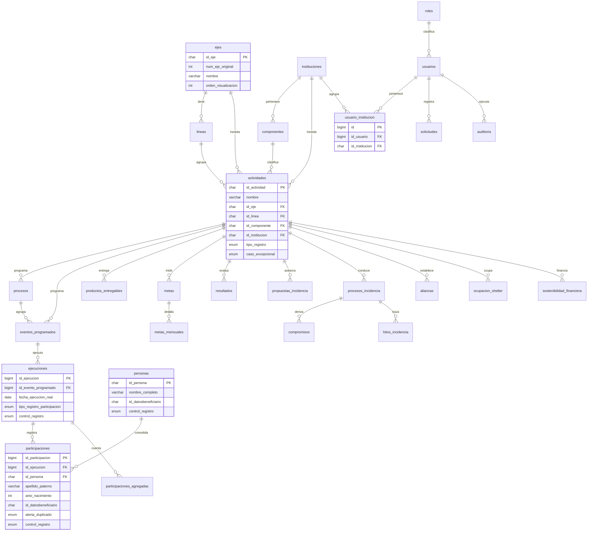

# 03 · Modelo de Datos

| | |
|---|---|
| **Documento** | 03 — Modelo de Datos |
| **Versión** | 1.0 |
| **Fecha** | 22 de junio de 2026 |
| **Motor** | MySQL 8.0+ (InnoDB, `utf8mb4`) |
| **Normalización** | 3NF (los resúmenes y dashboards son vistas, no tablas) |
| **Depende de** | [SRS (01)](../01-vision/01_SRS_especificacion_requisitos.md), [Arquitectura (02)](../02-arquitectura/02_arquitectura_sistema.md), [ADR-003](../02-arquitectura/ADR/ADR-003_deduplicacion-sin-postgres.md), [ADR-004](../02-arquitectura/ADR/ADR-004_segmentacion-institucion.md) |

> Traduce las 44 hojas del Excel v1.9 a un esquema relacional limpio en MySQL 8. Las hojas de resúmenes, dashboards y `seguimiento_metas` **no son tablas**: son vistas calculadas en vivo (esto elimina los KPIs inflados). Toda flecha hacia un hijo es una FK obligatoria con `ON DELETE RESTRICT`, salvo donde se indique opcional.

---

## 1. Diagrama Entidad-Relación



---

## 2. Modelo de pertenencia y autenticación (gobernanza de acceso)

La autenticación la provee **CodeIgniter Shield** con sus propias tablas (`users`, `auth_identities`, `auth_logins`, `auth_remember_tokens`, `auth_groups_users`, `auth_permissions_users`, `auth_access_tokens`), creadas por `php spark shield:setup`. Sobre ellas, el dominio añade:

- **`roles`** — catálogo lógico de los cuatro roles, espejo de los grupos de Shield, para reportería y UI.
- **`usuarios`** — vista/extensión de dominio que enlaza el `user_id` de Shield con metadatos (nombre para mostrar, rol, estatus). En implementación puede ser la propia tabla `users` de Shield extendida; aquí se modela como entidad lógica.
- **`usuario_institucion`** — relación N:N que define el **ámbito** de cada usuario (ADR-004). Es la pieza que reemplaza a la Row Level Security de PostgreSQL: el filtro de la capa Repository la consulta para acotar toda query.

> La institución de un registro operativo no se almacena de nuevo en cada tabla hija: se **hereda** de la actividad (`actividades.id_institucion`) por JOIN. El filtrado por ámbito se hace contra esa institución heredada.

---

## 3. Diccionario de datos

### 3.1 Catálogos / dimensiones

#### `ejes`
Catálogo maestro de ejes estratégicos (5 filas).

| Columna | Tipo | Nullable | Default | Restricciones | Descripción |
|---|---|---|---|---|---|
| `id_eje` | CHAR(12) | No | — | PK | Identificador (`EJE_00001`) |
| `num_eje_original` | INT | Sí | NULL | — | Número original en el Excel |
| `clave_eje_corto` | VARCHAR(40) | Sí | NULL | — | Clave corta |
| `nombre` | VARCHAR(200) | No | — | — | Nombre del eje |
| `orden_visualizacion` | INT | No | 0 | — | Orden en la UI |

#### `lineas`
Líneas de acción (20). FK → ejes.

| Columna | Tipo | Nullable | Default | Restricciones | Descripción |
|---|---|---|---|---|---|
| `id_linea` | CHAR(12) | No | — | PK | `LIN_00001` |
| `num_linea` | INT | Sí | NULL | — | Número original |
| `clave_linea_corta` | VARCHAR(40) | Sí | NULL | — | Clave corta |
| `nombre` | VARCHAR(200) | No | — | — | Nombre |
| `id_eje` | CHAR(12) | No | — | FK→ejes, RESTRICT | Eje padre |
| `orden_visualizacion` | INT | No | 0 | — | Orden |
| `estatus` | ENUM('activo','inactivo') | No | 'activo' | — | Estatus |

#### `instituciones`
Instituciones (5).

| Columna | Tipo | Nullable | Default | Restricciones | Descripción |
|---|---|---|---|---|---|
| `id_institucion` | CHAR(12) | No | — | PK | `INS_00001` |
| `num_institucion_original` | INT | Sí | NULL | — | Número original |
| `nombre` | VARCHAR(200) | No | — | — | Nombre |
| `estatus` | ENUM('activo','inactivo') | No | 'activo' | — | Estatus |
| `orden_visualizacion` | INT | No | 0 | — | Orden |

#### `componentes`
Componentes (17). FK → instituciones.

| Columna | Tipo | Nullable | Default | Restricciones | Descripción |
|---|---|---|---|---|---|
| `id_componente` | CHAR(12) | No | — | PK | `COM_00001` |
| `num_componente` | INT | Sí | NULL | — | Número |
| `clave_componente` | VARCHAR(40) | Sí | NULL | — | Clave |
| `nombre` | VARCHAR(200) | No | — | — | Nombre |
| `id_institucion` | CHAR(12) | No | — | FK→instituciones, RESTRICT | Institución |
| `orden_visualizacion` | INT | No | 0 | — | Orden |
| `estatus` | ENUM('activo','inactivo') | No | 'activo' | — | Estatus |

#### `actividades` — catálogo central (236 filas)
Define la herencia estratégica y la clasificación P/E/R.

| Columna | Tipo | Nullable | Default | Restricciones | Descripción |
|---|---|---|---|---|---|
| `id_actividad` | CHAR(8) | No | — | PK | `ACT_030` |
| `num_actividad` | INT | Sí | NULL | — | Número |
| `nombre` | VARCHAR(300) | No | — | — | Nombre |
| `id_eje` | CHAR(12) | No | — | FK→ejes | Heredado |
| `id_linea` | CHAR(12) | No | — | FK→lineas | Heredado |
| `id_componente` | CHAR(12) | No | — | FK→componentes | Heredado |
| `id_institucion` | CHAR(12) | No | — | FK→instituciones | Heredado (base del ámbito) |
| `tipo_registro` | ENUM('P','E','R') | No | — | — | Participación/Entregable/Resultado |
| `caso_excepcional` | ENUM('A','B','C','D') | Sí | NULL | — | Define comportamiento del formulario |

> La herencia se resuelve por estas FK; **no** se duplican `nom_eje`, `nom_componente`, etc., en las tablas hijas (como hacía el Excel): se traen por JOIN.

### 3.2 Núcleo transaccional

#### `procesos`
1 proceso/grupo que agrupa sesiones.

| Columna | Tipo | Nullable | Default | Restricciones | Descripción |
|---|---|---|---|---|---|
| `id_proceso` | BIGINT UNSIGNED AI | No | — | PK | Identidad |
| `nombre` | VARCHAR(250) | No | — | — | Nombre del proceso/grupo |
| `tipo_programacion` | ENUM('SESION_UNICA','MULTI_SESION_PROGRAMADA','PROCESO_CONTINUO') | No | — | — | Tipo |
| `id_actividad` | CHAR(8) | No | — | FK→actividades | Actividad |
| `fecha_inicio` | DATE | Sí | NULL | — | Inicio |
| `fecha_fin` | DATE | Sí | NULL | CHECK fin≥inicio | Fin |
| `total_sesiones_programadas` | INT | Sí | NULL | — | Sesiones planeadas |
| `responsable` | VARCHAR(150) | Sí | NULL | — | Responsable |
| `contacto` | VARCHAR(150) | Sí | NULL | — | Contacto |
| `estatus` | ENUM('activo','concluido','cancelado') | No | 'activo' | — | Estatus |
| `observaciones` | TEXT | Sí | NULL | — | Notas |

#### `eventos_programados`
1 evento/sesión planeada. Universo programado.

| Columna | Tipo | Nullable | Default | Restricciones | Descripción |
|---|---|---|---|---|---|
| `id_evento_programado` | BIGINT UNSIGNED AI | No | — | PK | `EVP_…` lógico |
| `id_actividad` | CHAR(8) | No | — | FK→actividades | Actividad |
| `id_proceso` | BIGINT UNSIGNED | Sí | NULL | FK→procesos | Obligatorio si tipo≠SESION_UNICA (regla de app) |
| `tipo_programacion` | ENUM(...) | No | — | — | Tipo |
| `fecha_inicio` | DATE | No | — | — | Inicio |
| `fecha_finalizacion` | DATE | No | — | CHECK ≥ inicio | Fin |
| `hora_inicio` | TIME | Sí | NULL | — | — |
| `hora_finalizacion` | TIME | Sí | NULL | — | — |
| `modalidad` | VARCHAR(60) | Sí | NULL | — | Catálogo |
| `lugar` | VARCHAR(200) | Sí | NULL | — | — |
| `calle_y_numero` | VARCHAR(200) | Sí | NULL | — | — |
| `colonia` | VARCHAR(120) | Sí | NULL | — | — |
| `responsable` | VARCHAR(150) | Sí | NULL | — | — |
| `contacto` | VARCHAR(150) | Sí | NULL | — | — |
| `estatus` | ENUM('programado','ejecutado','cancelado','reprogramado') | No | 'programado' | — | Estado del evento |
| `num_sesion` | INT | Sí | NULL | — | — |
| `total_sesiones` | INT | Sí | NULL | — | — |
| `observaciones` | TEXT | Sí | NULL | — | — |

#### `ejecuciones`
1 ejecución real de un evento programado.

| Columna | Tipo | Nullable | Default | Restricciones | Descripción |
|---|---|---|---|---|---|
| `id_ejecucion` | BIGINT UNSIGNED AI | No | — | PK | Identidad |
| `id_evento_programado` | BIGINT UNSIGNED | No | — | **FK→eventos_programados, RESTRICT** | RN-001 |
| `fecha_ejecucion_real` | DATE | Sí | NULL | — | Obligatoria para validar |
| `hora_inicio_real` | TIME | Sí | NULL | — | — |
| `hora_finalizacion_real` | TIME | Sí | NULL | — | — |
| `lugar_real` | VARCHAR(200) | Sí | NULL | — | — |
| `colonia_real` | VARCHAR(120) | Sí | NULL | — | — |
| `responsable_real` | VARCHAR(150) | Sí | NULL | — | — |
| `estatus_ejecucion` | ENUM('ejecutada','suspendida','parcial') | Sí | NULL | — | Catálogo |
| `tipo_registro_participacion` | ENUM('Nominal','Agregado','Mixta') | No | 'Nominal' | — | Tipo |
| `total_participantes` | INT | Sí | NULL | CHECK ≥0 | Conteo |
| `evidencia_url` | VARCHAR(500) | Sí | NULL | — | Enlace a Drive |
| `nombre_archivo_evidencia` | VARCHAR(200) | Sí | NULL | — | Nombre normalizado |
| `resumen_narrativo` | TEXT | Sí | NULL | — | Obligatorio para validar |
| `control_registro` | ENUM('CAPTURADO','INCOMPLETO','REVISAR','OK','AGREGADO') | No | 'CAPTURADO' | — | Máquina de estados |
| `observaciones` | TEXT | Sí | NULL | — | — |

#### `participaciones`
1 persona en 1 ejecución (una asistencia).

| Columna | Tipo | Nullable | Default | Restricciones | Descripción |
|---|---|---|---|---|---|
| `id_participacion` | BIGINT UNSIGNED AI | No | — | PK | `PAR_…` lógico |
| `id_ejecucion` | BIGINT UNSIGNED | No | — | **FK→ejecuciones, RESTRICT** | RN-002 |
| `id_persona` | CHAR(10) | Sí | NULL | FK→personas | Asignada por dedup |
| `nombres` | VARCHAR(120) | No | — | — | Nombre(s) |
| `apellido_paterno` | VARCHAR(80) | No | — | — | Obligatorio (RN-041) |
| `apellido_materno` | VARCHAR(80) | Sí | NULL | — | Opcional (RN-042) |
| `anio_nacimiento` | SMALLINT | Sí | NULL | CHECK 1900–2026 | Año, no fecha (RN-046) |
| `sexo` | ENUM('F','M','X') | No | — | — | Obligatorio (RN-045) |
| `telefono` | VARCHAR(20) | No | — | — | Obligatorio (RN-043) |
| `correo` | VARCHAR(150) | Sí | NULL | — | — |
| `colonia_persona` | VARCHAR(120) | No | — | — | Obligatoria (RN-047) |
| `id_datosbeneficiario` | CHAR(40) | No | — | INDEX | Clave de dedup normalizada (servidor) |
| `alerta_duplicado` | ENUM('OK','DUPLICADO_EN_CAPTURA') | No | 'OK' | — | Marca de cola |
| `fecha_participacion` | DATE | Sí | NULL | — | Desde la ejecución; alimenta metas |
| `control_registro` | ENUM('CAPTURADO','INCOMPLETO','REVISAR','OK') | No | 'CAPTURADO' | — | Máquina de estados |
| `control_automatico` | ENUM(...) | Sí | NULL | — | Propuesto por el sistema |
| `decision_coordinacion` | ENUM(...) | Sí | NULL | — | Prevalece (RN-090) |
| `detalle_validacion` | VARCHAR(300) | Sí | NULL | — | Detalle |

#### `participaciones_agregadas`
1 conteo no nominal por periodo.

| Columna | Tipo | Nullable | Default | Restricciones | Descripción |
|---|---|---|---|---|---|
| `id_participacion_agregada` | BIGINT UNSIGNED AI | No | — | PK | Identidad |
| `id_ejecucion` | BIGINT UNSIGNED | No | — | **FK→ejecuciones, RESTRICT** | RN-003 |
| `tipo_registro_participacion` | ENUM('Agregado','Mixta') | No | 'Agregado' | — | Tipo |
| `sexo_grupo` | VARCHAR(40) | Sí | NULL | — | Mixto/No desagregado |
| `grupo_edad_aprox` | VARCHAR(40) | Sí | NULL | — | Rango |
| `cantidad_participantes` | INT | No | — | CHECK ≥0 | El conteo |
| `motivo_no_nominal` | VARCHAR(200) | Sí | NULL | — | Ej. "Unidad: sesión psicológica" |
| `fuente_conteo` | VARCHAR(200) | Sí | NULL | — | Ej. "Expedientes clínicos" |
| `periodo_corte` | ENUM('M01'..'M18') | Sí | NULL | — | Obligatorio en casos A/B (regla de app) |
| `evidencia_url` | VARCHAR(500) | Sí | NULL | — | Enlace |
| `control_registro` | ENUM('AGREGADO','INCOMPLETO') | No | 'AGREGADO' | — | — |

#### `personas` — derivada
1 persona única. Poblada por deduplicación; **sin alta manual**.

| Columna | Tipo | Nullable | Default | Restricciones | Descripción |
|---|---|---|---|---|---|
| `id_persona` | CHAR(10) | No | — | PK | `PER_00001` |
| `nombres` | VARCHAR(120) | Sí | NULL | — | — |
| `apellido_paterno` | VARCHAR(80) | Sí | NULL | — | — |
| `apellido_materno` | VARCHAR(80) | Sí | NULL | — | — |
| `nombre_completo` | VARCHAR(300) | Sí | NULL | — | Calculado |
| `anio_nacimiento` | SMALLINT | Sí | NULL | — | — |
| `sexo` | ENUM('F','M','X') | Sí | NULL | — | — |
| `telefono` | VARCHAR(20) | Sí | NULL | — | — |
| `correo` | VARCHAR(150) | Sí | NULL | — | — |
| `colonia` | VARCHAR(120) | Sí | NULL | — | — |
| `id_datosbeneficiario` | CHAR(40) | No | — | UNIQUE | Clave de dedup |
| `primera_participacion` | DATE | Sí | NULL | — | — |
| `total_participaciones` | INT | No | 0 | — | Calculado |
| `control_registro` | ENUM('OK','REVISAR') | No | 'REVISAR' | — | Solo OK cuenta como validada |
| `decision_coordinacion` | VARCHAR(60) | Sí | NULL | — | — |

#### `productos_entregables`
1 entregable (solo actividades tipo E).

| Columna | Tipo | Nullable | Default | Restricciones | Descripción |
|---|---|---|---|---|---|
| `id_producto` | BIGINT UNSIGNED AI | No | — | PK | Identidad |
| `id_actividad` | CHAR(8) | No | — | FK→actividades (validar tipo E en app) | RN-020 |
| `nombre_producto` | VARCHAR(250) | No | — | — | Obligatorio |
| `tipo_producto` | VARCHAR(80) | Sí | NULL | — | Catálogo |
| `fecha_inicio` | DATE | Sí | NULL | — | — |
| `fecha_entrega` | DATE | Sí | NULL | — | Alimenta metas |
| `responsable` | VARCHAR(150) | Sí | NULL | — | — |
| `cantidad` | INT | Sí | NULL | CHECK ≥0 | — |
| `unidad_medida` | VARCHAR(60) | Sí | NULL | — | — |
| `estatus` | ENUM('en_proceso','entregado','cancelado') | No | 'en_proceso' | — | — |
| `descripcion` | TEXT | Sí | NULL | — | — |
| `evidencia_url` | VARCHAR(500) | Sí | NULL | — | Enlace |
| `nombre_archivo_evidencia` | VARCHAR(200) | Sí | NULL | — | Normalizado |
| `control_registro` | ENUM('CAPTURADO','INCOMPLETO','OK') | No | 'CAPTURADO' | — | — |

### 3.3 Metas

#### `metas`
Meta anual por actividad.

| Columna | Tipo | Nullable | Default | Restricciones | Descripción |
|---|---|---|---|---|---|
| `id_meta` | BIGINT UNSIGNED AI | No | — | PK | — |
| `id_actividad` | CHAR(8) | No | — | FK→actividades, UNIQUE | Una meta por actividad |
| `unidad_meta` | VARCHAR(80) | Sí | NULL | — | — |
| `unidad_especifica` | VARCHAR(120) | Sí | NULL | — | — |
| `meta_anual_total` | DECIMAL(12,2) | Sí | NULL | CHECK ≥0 | — |
| `observaciones` | TEXT | Sí | NULL | — | — |

#### `metas_mensuales` (normalización de M01–M18)

| Columna | Tipo | Nullable | Default | Restricciones | Descripción |
|---|---|---|---|---|---|
| `id_meta_mensual` | BIGINT UNSIGNED AI | No | — | PK | — |
| `id_meta` | BIGINT UNSIGNED | No | — | FK→metas, RESTRICT; UNIQUE(id_meta,mes) | — |
| `mes` | ENUM('M01'..'M18') | No | — | — | Periodo |
| `valor` | DECIMAL(12,2) | No | 0 | CHECK ≥0 | Meta del mes |

### 3.4 Resultados (tipo R)

#### `resultados`

| Columna | Tipo | Nullable | Default | Restricciones | Descripción |
|---|---|---|---|---|---|
| `id_resultado` | BIGINT UNSIGNED AI | No | — | PK | — |
| `id_actividad` | CHAR(8) | No | — | FK→actividades (tipo R en app) | — |
| `indicador` | VARCHAR(250) | No | — | — | Qué cambio se mide |
| `linea_base` | DECIMAL(14,4) | Sí | NULL | — | — |
| `valor_medido` | DECIMAL(14,4) | Sí | NULL | — | — |
| `metodo_medicion` | VARCHAR(200) | Sí | NULL | — | Encuesta/registro |
| `fecha_medicion` | DATE | Sí | NULL | — | — |
| `evidencia_url` | VARCHAR(500) | Sí | NULL | — | Enlace |

### 3.5 Incidencia

#### `propuestas_incidencia`
`id_propuesta` (PK), `nombre_propuesta`, `promotor_colectivo`, `tipo_actor`, `fecha_inicio_asesoria`, `responsable_equipo`, `sesiones_documentadas`, `mejora_documentada`, `cambios_resultado_asesoria`, `evidencia_principal`, `alineada_proyectos_estrategicos` (BOOL), `criterios_alineacion_nota`, `estatus`, `elegible_reporte` (BOOL), `id_actividad` (FK→actividades), `periodo_reporte`, `control_registro`.

#### `procesos_incidencia`
`id_proceso_incidencia` (PK), datos del proceso, criterios de elegibilidad, `ultimo_hito_resumen`, `control_registro`, `id_actividad` (FK). Persiste activo hasta concluir.

#### `compromisos`
`id_compromiso` (PK), `id_proceso_incidencia` (FK→procesos_incidencia, RESTRICT, RN-004), identificación, seguimiento documentado, criterios de elegibilidad, `control_registro`.

#### `alianzas`
`id_alianza` (PK), datos de la alianza, criterios de elegibilidad, `id_actividad` (FK), `control_registro`. (ACT_048)

#### `hitos_incidencia`
`id_hito` (PK), `id_proceso_incidencia` (FK→procesos_incidencia, RESTRICT), `fecha_hito`, `tipo_hito`, `descripcion_hito`, `evidencia_nombre_o_nota`, `registrado_por` (FK→usuarios), `observaciones`. Registro libre; no genera métricas directas.

### 3.6 Verticales

#### `ocupacion_shelter`
`id_ocupacion` (PK), `id_actividad` (FK, ACT_224), `mes_periodo` (ENUM M01–M18), `tipo_espacio`, `capacidad_instalada` (INT), `ocupacion` (INT), `pct_ocupacion` (calc. en vista), `fuente`, `control_registro`.

#### `sostenibilidad_financiera`
`id_registro` (PK), `id_actividad` (FK), `mes_periodo` (ENUM), `ingresos_brutos`, `costos_directos`, `costos_indirectos`, `recursos_efectivo`, `recursos_especie`, `fuente_datos`, `meta_anual`, `control_registro`. Los campos `utilidad_neta_mes`, `recursos_totales_mes`, `utilidad_acum_anio`, `recursos_acum_anio`, `pct_avance_anual`, `semaforo` se **calculan en vista**, no se almacenan.

### 3.7 Gobernanza y soporte

#### `roles`
`id_rol` (PK), `clave` (ENUM 'capturista','coordinacion','direccion','administrador'), `nombre`, `descripcion`.

#### `usuarios` (extensión de dominio sobre Shield `users`)
`id_usuario` (PK, = user_id de Shield), `nombre`, `email`, `id_rol` (FK→roles), `estatus` (ENUM 'activo','inactivo').

#### `usuario_institucion` — ámbito (ADR-004)
| Columna | Tipo | Nullable | Default | Restricciones | Descripción |
|---|---|---|---|---|---|
| `id` | BIGINT UNSIGNED AI | No | — | PK | — |
| `id_usuario` | BIGINT UNSIGNED | No | — | FK→usuarios, CASCADE; UNIQUE(id_usuario,id_institucion) | — |
| `id_institucion` | CHAR(12) | No | — | FK→instituciones, RESTRICT | Ámbito permitido |

#### `solicitudes`
`id_solicitud` (PK), `fecha_solicitud`, `id_solicitante` (FK→usuarios), `rol_solicitante`, `entidad_afectada`, `descripcion`, `tipo_solicitud` (ENUM 'correccion','mejora','ajuste'), `nivel_criticidad` (ENUM 'BAJA','MEDIA','ALTA'), `impacto`, `estado` (ENUM 'en_revision','en_proceso','resuelta','descartada'), `responsable_atencion` (FK→usuarios), `fecha_resolucion`, `comentarios`.

#### `auditoria` — automática, append-only
| Columna | Tipo | Nullable | Default | Restricciones | Descripción |
|---|---|---|---|---|---|
| `id_evento` | BIGINT UNSIGNED AI | No | — | PK | — |
| `fecha_hora` | DATETIME(6) | No | CURRENT_TIMESTAMP(6) | — | Marca temporal |
| `id_usuario` | BIGINT UNSIGNED | Sí | NULL | FK→usuarios | Quién |
| `entidad` | VARCHAR(60) | No | — | — | Tabla afectada |
| `id_registro` | VARCHAR(40) | No | — | — | PK afectada |
| `accion` | ENUM('alta','edicion','baja','reclasificacion','validacion') | No | — | — | Qué |
| `valor_antes` | JSON | Sí | NULL | — | Estado previo |
| `valor_despues` | JSON | Sí | NULL | — | Estado nuevo |

---

## 4. DDL completo (MySQL 8)

Script listo para ejecutar (extracto representativo del núcleo, metas y gobernanza; los módulos de incidencia y verticales siguen el mismo patrón descrito en §3.5–3.6). Charset y colación globales: `utf8mb4` / `utf8mb4_0900_ai_ci` (acento-insensible para comparaciones de dedup).

```sql
SET NAMES utf8mb4;
SET FOREIGN_KEY_CHECKS = 1;

-- ============ DIMENSIONES ============
CREATE TABLE ejes (
    id_eje              CHAR(12)     NOT NULL,
    num_eje_original    INT          NULL,
    clave_eje_corto     VARCHAR(40)  NULL,
    nombre              VARCHAR(200) NOT NULL,
    orden_visualizacion INT          NOT NULL DEFAULT 0,
    PRIMARY KEY (id_eje)
) ENGINE=InnoDB DEFAULT CHARSET=utf8mb4 COLLATE=utf8mb4_0900_ai_ci;

CREATE TABLE lineas (
    id_linea            CHAR(12)     NOT NULL,
    num_linea           INT          NULL,
    clave_linea_corta   VARCHAR(40)  NULL,
    nombre              VARCHAR(200) NOT NULL,
    id_eje              CHAR(12)     NOT NULL,
    orden_visualizacion INT          NOT NULL DEFAULT 0,
    estatus             ENUM('activo','inactivo') NOT NULL DEFAULT 'activo',
    PRIMARY KEY (id_linea),
    KEY idx_lineas_eje (id_eje),
    CONSTRAINT fk_lineas_eje FOREIGN KEY (id_eje) REFERENCES ejes(id_eje) ON DELETE RESTRICT
) ENGINE=InnoDB DEFAULT CHARSET=utf8mb4 COLLATE=utf8mb4_0900_ai_ci;

CREATE TABLE instituciones (
    id_institucion           CHAR(12)     NOT NULL,
    num_institucion_original INT          NULL,
    nombre                   VARCHAR(200) NOT NULL,
    estatus                  ENUM('activo','inactivo') NOT NULL DEFAULT 'activo',
    orden_visualizacion      INT          NOT NULL DEFAULT 0,
    PRIMARY KEY (id_institucion)
) ENGINE=InnoDB DEFAULT CHARSET=utf8mb4 COLLATE=utf8mb4_0900_ai_ci;

CREATE TABLE componentes (
    id_componente       CHAR(12)     NOT NULL,
    num_componente      INT          NULL,
    clave_componente    VARCHAR(40)  NULL,
    nombre              VARCHAR(200) NOT NULL,
    id_institucion      CHAR(12)     NOT NULL,
    orden_visualizacion INT          NOT NULL DEFAULT 0,
    estatus             ENUM('activo','inactivo') NOT NULL DEFAULT 'activo',
    PRIMARY KEY (id_componente),
    KEY idx_comp_inst (id_institucion),
    CONSTRAINT fk_comp_inst FOREIGN KEY (id_institucion) REFERENCES instituciones(id_institucion) ON DELETE RESTRICT
) ENGINE=InnoDB DEFAULT CHARSET=utf8mb4 COLLATE=utf8mb4_0900_ai_ci;

CREATE TABLE actividades (
    id_actividad     CHAR(8)      NOT NULL,
    num_actividad    INT          NULL,
    nombre           VARCHAR(300) NOT NULL,
    id_eje           CHAR(12)     NOT NULL,
    id_linea         CHAR(12)     NOT NULL,
    id_componente    CHAR(12)     NOT NULL,
    id_institucion   CHAR(12)     NOT NULL,
    tipo_registro    ENUM('P','E','R') NOT NULL,
    caso_excepcional ENUM('A','B','C','D') NULL,
    PRIMARY KEY (id_actividad),
    KEY idx_act_inst (id_institucion),
    KEY idx_act_tipo (tipo_registro),
    CONSTRAINT fk_act_eje  FOREIGN KEY (id_eje)         REFERENCES ejes(id_eje)                 ON DELETE RESTRICT,
    CONSTRAINT fk_act_lin  FOREIGN KEY (id_linea)       REFERENCES lineas(id_linea)             ON DELETE RESTRICT,
    CONSTRAINT fk_act_com  FOREIGN KEY (id_componente)  REFERENCES componentes(id_componente)   ON DELETE RESTRICT,
    CONSTRAINT fk_act_inst FOREIGN KEY (id_institucion) REFERENCES instituciones(id_institucion) ON DELETE RESTRICT
) ENGINE=InnoDB DEFAULT CHARSET=utf8mb4 COLLATE=utf8mb4_0900_ai_ci;

-- ============ NÚCLEO TRANSACCIONAL ============
CREATE TABLE procesos (
    id_proceso                 BIGINT UNSIGNED NOT NULL AUTO_INCREMENT,
    nombre                     VARCHAR(250) NOT NULL,
    tipo_programacion          ENUM('SESION_UNICA','MULTI_SESION_PROGRAMADA','PROCESO_CONTINUO') NOT NULL,
    id_actividad               CHAR(8)      NOT NULL,
    fecha_inicio               DATE NULL,
    fecha_fin                  DATE NULL,
    total_sesiones_programadas INT  NULL,
    responsable                VARCHAR(150) NULL,
    contacto                   VARCHAR(150) NULL,
    estatus                    ENUM('activo','concluido','cancelado') NOT NULL DEFAULT 'activo',
    observaciones              TEXT NULL,
    PRIMARY KEY (id_proceso),
    KEY idx_proc_act (id_actividad),
    CONSTRAINT fk_proc_act  FOREIGN KEY (id_actividad) REFERENCES actividades(id_actividad) ON DELETE RESTRICT,
    CONSTRAINT chk_proc_fechas CHECK (fecha_fin IS NULL OR fecha_inicio IS NULL OR fecha_fin >= fecha_inicio)
) ENGINE=InnoDB DEFAULT CHARSET=utf8mb4 COLLATE=utf8mb4_0900_ai_ci;

CREATE TABLE eventos_programados (
    id_evento_programado BIGINT UNSIGNED NOT NULL AUTO_INCREMENT,
    id_actividad         CHAR(8) NOT NULL,
    id_proceso           BIGINT UNSIGNED NULL,
    tipo_programacion    ENUM('SESION_UNICA','MULTI_SESION_PROGRAMADA','PROCESO_CONTINUO') NOT NULL,
    fecha_inicio         DATE NOT NULL,
    fecha_finalizacion   DATE NOT NULL,
    hora_inicio          TIME NULL,
    hora_finalizacion    TIME NULL,
    modalidad            VARCHAR(60)  NULL,
    lugar                VARCHAR(200) NULL,
    calle_y_numero       VARCHAR(200) NULL,
    colonia              VARCHAR(120) NULL,
    responsable          VARCHAR(150) NULL,
    contacto             VARCHAR(150) NULL,
    estatus              ENUM('programado','ejecutado','cancelado','reprogramado') NOT NULL DEFAULT 'programado',
    num_sesion           INT NULL,
    total_sesiones       INT NULL,
    observaciones        TEXT NULL,
    PRIMARY KEY (id_evento_programado),
    KEY idx_evp_act (id_actividad),
    KEY idx_evp_proc (id_proceso),
    KEY idx_evp_fecha (fecha_inicio),
    CONSTRAINT fk_evp_act  FOREIGN KEY (id_actividad) REFERENCES actividades(id_actividad) ON DELETE RESTRICT,
    CONSTRAINT fk_evp_proc FOREIGN KEY (id_proceso)   REFERENCES procesos(id_proceso)       ON DELETE RESTRICT,
    CONSTRAINT chk_evp_fechas CHECK (fecha_finalizacion >= fecha_inicio)
) ENGINE=InnoDB DEFAULT CHARSET=utf8mb4 COLLATE=utf8mb4_0900_ai_ci;

CREATE TABLE ejecuciones (
    id_ejecucion                BIGINT UNSIGNED NOT NULL AUTO_INCREMENT,
    id_evento_programado        BIGINT UNSIGNED NOT NULL,
    fecha_ejecucion_real        DATE NULL,
    hora_inicio_real            TIME NULL,
    hora_finalizacion_real      TIME NULL,
    lugar_real                  VARCHAR(200) NULL,
    colonia_real                VARCHAR(120) NULL,
    responsable_real            VARCHAR(150) NULL,
    estatus_ejecucion           ENUM('ejecutada','suspendida','parcial') NULL,
    tipo_registro_participacion ENUM('Nominal','Agregado','Mixta') NOT NULL DEFAULT 'Nominal',
    total_participantes         INT NULL,
    evidencia_url               VARCHAR(500) NULL,
    nombre_archivo_evidencia    VARCHAR(200) NULL,
    resumen_narrativo           TEXT NULL,
    control_registro            ENUM('CAPTURADO','INCOMPLETO','REVISAR','OK','AGREGADO') NOT NULL DEFAULT 'CAPTURADO',
    observaciones               TEXT NULL,
    PRIMARY KEY (id_ejecucion),
    KEY idx_eje_evp (id_evento_programado),
    KEY idx_eje_control (control_registro),
    KEY idx_eje_fecha (fecha_ejecucion_real),
    CONSTRAINT fk_eje_evp FOREIGN KEY (id_evento_programado) REFERENCES eventos_programados(id_evento_programado) ON DELETE RESTRICT,
    CONSTRAINT chk_eje_total CHECK (total_participantes IS NULL OR total_participantes >= 0)
) ENGINE=InnoDB DEFAULT CHARSET=utf8mb4 COLLATE=utf8mb4_0900_ai_ci;

CREATE TABLE personas (
    id_persona            CHAR(10)     NOT NULL,
    nombres               VARCHAR(120) NULL,
    apellido_paterno      VARCHAR(80)  NULL,
    apellido_materno      VARCHAR(80)  NULL,
    nombre_completo       VARCHAR(300) NULL,
    anio_nacimiento       SMALLINT     NULL,
    sexo                  ENUM('F','M','X') NULL,
    telefono              VARCHAR(20)  NULL,
    correo                VARCHAR(150) NULL,
    colonia               VARCHAR(120) NULL,
    id_datosbeneficiario  CHAR(40)     NOT NULL,
    primera_participacion DATE         NULL,
    total_participaciones INT          NOT NULL DEFAULT 0,
    control_registro      ENUM('OK','REVISAR') NOT NULL DEFAULT 'REVISAR',
    decision_coordinacion VARCHAR(60)  NULL,
    PRIMARY KEY (id_persona),
    UNIQUE KEY uq_persona_clave (id_datosbeneficiario)
) ENGINE=InnoDB DEFAULT CHARSET=utf8mb4 COLLATE=utf8mb4_0900_ai_ci;

CREATE TABLE participaciones (
    id_participacion      BIGINT UNSIGNED NOT NULL AUTO_INCREMENT,
    id_ejecucion          BIGINT UNSIGNED NOT NULL,
    id_persona            CHAR(10) NULL,
    nombres               VARCHAR(120) NOT NULL,
    apellido_paterno      VARCHAR(80)  NOT NULL,
    apellido_materno      VARCHAR(80)  NULL,
    anio_nacimiento       SMALLINT     NULL,
    sexo                  ENUM('F','M','X') NOT NULL,
    telefono              VARCHAR(20)  NOT NULL,
    correo                VARCHAR(150) NULL,
    colonia_persona       VARCHAR(120) NOT NULL,
    id_datosbeneficiario  CHAR(40)     NOT NULL,
    alerta_duplicado      ENUM('OK','DUPLICADO_EN_CAPTURA') NOT NULL DEFAULT 'OK',
    fecha_participacion   DATE NULL,
    control_registro      ENUM('CAPTURADO','INCOMPLETO','REVISAR','OK') NOT NULL DEFAULT 'CAPTURADO',
    control_automatico    ENUM('OK','INCOMPLETO','REVISAR') NULL,
    decision_coordinacion ENUM('OK','INCOMPLETO','REVISAR') NULL,
    detalle_validacion    VARCHAR(300) NULL,
    PRIMARY KEY (id_participacion),
    KEY idx_par_eje (id_ejecucion),
    KEY idx_par_persona (id_persona),
    KEY idx_par_clave (id_datosbeneficiario),
    KEY idx_par_control (control_registro),
    CONSTRAINT fk_par_eje     FOREIGN KEY (id_ejecucion) REFERENCES ejecuciones(id_ejecucion) ON DELETE RESTRICT,
    CONSTRAINT fk_par_persona FOREIGN KEY (id_persona)   REFERENCES personas(id_persona)       ON DELETE RESTRICT,
    CONSTRAINT chk_par_anio CHECK (anio_nacimiento IS NULL OR (anio_nacimiento BETWEEN 1900 AND 2026))
) ENGINE=InnoDB DEFAULT CHARSET=utf8mb4 COLLATE=utf8mb4_0900_ai_ci;

CREATE TABLE participaciones_agregadas (
    id_participacion_agregada   BIGINT UNSIGNED NOT NULL AUTO_INCREMENT,
    id_ejecucion                BIGINT UNSIGNED NOT NULL,
    tipo_registro_participacion ENUM('Agregado','Mixta') NOT NULL DEFAULT 'Agregado',
    sexo_grupo                  VARCHAR(40)  NULL,
    grupo_edad_aprox            VARCHAR(40)  NULL,
    cantidad_participantes      INT NOT NULL,
    motivo_no_nominal           VARCHAR(200) NULL,
    fuente_conteo               VARCHAR(200) NULL,
    periodo_corte               ENUM('M01','M02','M03','M04','M05','M06','M07','M08','M09','M10','M11','M12','M13','M14','M15','M16','M17','M18') NULL,
    evidencia_url               VARCHAR(500) NULL,
    control_registro            ENUM('AGREGADO','INCOMPLETO') NOT NULL DEFAULT 'AGREGADO',
    PRIMARY KEY (id_participacion_agregada),
    KEY idx_agr_eje (id_ejecucion),
    CONSTRAINT fk_agr_eje FOREIGN KEY (id_ejecucion) REFERENCES ejecuciones(id_ejecucion) ON DELETE RESTRICT,
    CONSTRAINT chk_agr_cant CHECK (cantidad_participantes >= 0)
) ENGINE=InnoDB DEFAULT CHARSET=utf8mb4 COLLATE=utf8mb4_0900_ai_ci;

CREATE TABLE productos_entregables (
    id_producto              BIGINT UNSIGNED NOT NULL AUTO_INCREMENT,
    id_actividad             CHAR(8) NOT NULL,
    nombre_producto          VARCHAR(250) NOT NULL,
    tipo_producto            VARCHAR(80) NULL,
    fecha_inicio             DATE NULL,
    fecha_entrega            DATE NULL,
    responsable              VARCHAR(150) NULL,
    cantidad                 INT NULL,
    unidad_medida            VARCHAR(60) NULL,
    estatus                  ENUM('en_proceso','entregado','cancelado') NOT NULL DEFAULT 'en_proceso',
    descripcion              TEXT NULL,
    evidencia_url            VARCHAR(500) NULL,
    nombre_archivo_evidencia VARCHAR(200) NULL,
    control_registro         ENUM('CAPTURADO','INCOMPLETO','OK') NOT NULL DEFAULT 'CAPTURADO',
    PRIMARY KEY (id_producto),
    KEY idx_prod_act (id_actividad),
    CONSTRAINT fk_prod_act FOREIGN KEY (id_actividad) REFERENCES actividades(id_actividad) ON DELETE RESTRICT,
    CONSTRAINT chk_prod_cant CHECK (cantidad IS NULL OR cantidad >= 0)
) ENGINE=InnoDB DEFAULT CHARSET=utf8mb4 COLLATE=utf8mb4_0900_ai_ci;

-- ============ METAS ============
CREATE TABLE metas (
    id_meta           BIGINT UNSIGNED NOT NULL AUTO_INCREMENT,
    id_actividad      CHAR(8) NOT NULL,
    unidad_meta       VARCHAR(80)  NULL,
    unidad_especifica VARCHAR(120) NULL,
    meta_anual_total  DECIMAL(12,2) NULL,
    observaciones     TEXT NULL,
    PRIMARY KEY (id_meta),
    UNIQUE KEY uq_meta_actividad (id_actividad),
    CONSTRAINT fk_meta_act FOREIGN KEY (id_actividad) REFERENCES actividades(id_actividad) ON DELETE RESTRICT,
    CONSTRAINT chk_meta_anual CHECK (meta_anual_total IS NULL OR meta_anual_total >= 0)
) ENGINE=InnoDB DEFAULT CHARSET=utf8mb4 COLLATE=utf8mb4_0900_ai_ci;

CREATE TABLE metas_mensuales (
    id_meta_mensual BIGINT UNSIGNED NOT NULL AUTO_INCREMENT,
    id_meta         BIGINT UNSIGNED NOT NULL,
    mes             ENUM('M01','M02','M03','M04','M05','M06','M07','M08','M09','M10','M11','M12','M13','M14','M15','M16','M17','M18') NOT NULL,
    valor           DECIMAL(12,2) NOT NULL DEFAULT 0,
    PRIMARY KEY (id_meta_mensual),
    UNIQUE KEY uq_meta_mes (id_meta, mes),
    CONSTRAINT fk_mm_meta FOREIGN KEY (id_meta) REFERENCES metas(id_meta) ON DELETE RESTRICT,
    CONSTRAINT chk_mm_valor CHECK (valor >= 0)
) ENGINE=InnoDB DEFAULT CHARSET=utf8mb4 COLLATE=utf8mb4_0900_ai_ci;

-- ============ GOBERNANZA ============
CREATE TABLE roles (
    id_rol      TINYINT UNSIGNED NOT NULL AUTO_INCREMENT,
    clave       ENUM('capturista','coordinacion','direccion','administrador') NOT NULL,
    nombre      VARCHAR(80)  NOT NULL,
    descripcion VARCHAR(250) NULL,
    PRIMARY KEY (id_rol),
    UNIQUE KEY uq_rol_clave (clave)
) ENGINE=InnoDB DEFAULT CHARSET=utf8mb4 COLLATE=utf8mb4_0900_ai_ci;

CREATE TABLE usuarios (
    id_usuario BIGINT UNSIGNED NOT NULL,           -- = users.id de Shield
    nombre     VARCHAR(150) NOT NULL,
    email      VARCHAR(254) NOT NULL,
    id_rol     TINYINT UNSIGNED NOT NULL,
    estatus    ENUM('activo','inactivo') NOT NULL DEFAULT 'activo',
    PRIMARY KEY (id_usuario),
    UNIQUE KEY uq_usuario_email (email),
    KEY idx_usuario_rol (id_rol),
    CONSTRAINT fk_usuario_rol FOREIGN KEY (id_rol) REFERENCES roles(id_rol) ON DELETE RESTRICT
) ENGINE=InnoDB DEFAULT CHARSET=utf8mb4 COLLATE=utf8mb4_0900_ai_ci;

CREATE TABLE usuario_institucion (
    id             BIGINT UNSIGNED NOT NULL AUTO_INCREMENT,
    id_usuario     BIGINT UNSIGNED NOT NULL,
    id_institucion CHAR(12) NOT NULL,
    PRIMARY KEY (id),
    UNIQUE KEY uq_usuario_inst (id_usuario, id_institucion),
    CONSTRAINT fk_ui_usuario FOREIGN KEY (id_usuario)     REFERENCES usuarios(id_usuario)         ON DELETE CASCADE,
    CONSTRAINT fk_ui_inst    FOREIGN KEY (id_institucion) REFERENCES instituciones(id_institucion) ON DELETE RESTRICT
) ENGINE=InnoDB DEFAULT CHARSET=utf8mb4 COLLATE=utf8mb4_0900_ai_ci;

CREATE TABLE solicitudes (
    id_solicitud         BIGINT UNSIGNED NOT NULL AUTO_INCREMENT,
    fecha_solicitud      DATETIME NOT NULL DEFAULT CURRENT_TIMESTAMP,
    id_solicitante       BIGINT UNSIGNED NOT NULL,
    rol_solicitante      VARCHAR(40) NULL,
    entidad_afectada     VARCHAR(60) NULL,
    descripcion          TEXT NOT NULL,
    tipo_solicitud       ENUM('correccion','mejora','ajuste') NOT NULL,
    nivel_criticidad     ENUM('BAJA','MEDIA','ALTA') NOT NULL DEFAULT 'MEDIA',
    impacto              VARCHAR(250) NULL,
    estado               ENUM('en_revision','en_proceso','resuelta','descartada') NOT NULL DEFAULT 'en_revision',
    responsable_atencion BIGINT UNSIGNED NULL,
    fecha_resolucion     DATETIME NULL,
    comentarios          TEXT NULL,
    PRIMARY KEY (id_solicitud),
    KEY idx_sol_estado (estado),
    CONSTRAINT fk_sol_solicitante FOREIGN KEY (id_solicitante)       REFERENCES usuarios(id_usuario) ON DELETE RESTRICT,
    CONSTRAINT fk_sol_responsable FOREIGN KEY (responsable_atencion) REFERENCES usuarios(id_usuario) ON DELETE SET NULL
) ENGINE=InnoDB DEFAULT CHARSET=utf8mb4 COLLATE=utf8mb4_0900_ai_ci;

CREATE TABLE auditoria (
    id_evento     BIGINT UNSIGNED NOT NULL AUTO_INCREMENT,
    fecha_hora    DATETIME(6) NOT NULL DEFAULT CURRENT_TIMESTAMP(6),
    id_usuario    BIGINT UNSIGNED NULL,
    entidad       VARCHAR(60) NOT NULL,
    id_registro   VARCHAR(40) NOT NULL,
    accion        ENUM('alta','edicion','baja','reclasificacion','validacion') NOT NULL,
    valor_antes   JSON NULL,
    valor_despues JSON NULL,
    PRIMARY KEY (id_evento),
    KEY idx_aud_entidad (entidad, id_registro),
    KEY idx_aud_usuario (id_usuario),
    CONSTRAINT fk_aud_usuario FOREIGN KEY (id_usuario) REFERENCES usuarios(id_usuario) ON DELETE SET NULL
) ENGINE=InnoDB DEFAULT CHARSET=utf8mb4 COLLATE=utf8mb4_0900_ai_ci;
```

### 4.1 Vistas calculadas (reemplazan los resúmenes/dashboards del Excel)

```sql
-- Beneficiarios únicos: solo personas validadas (control OK)
CREATE OR REPLACE VIEW vw_beneficiarios_unicos AS
SELECT a.id_institucion,
       COUNT(DISTINCT p.id_persona) AS beneficiarios_unicos
FROM participaciones par
JOIN personas p             ON p.id_persona = par.id_persona AND p.control_registro = 'OK'
JOIN ejecuciones e          ON e.id_ejecucion = par.id_ejecucion
JOIN eventos_programados ev ON ev.id_evento_programado = e.id_evento_programado
JOIN actividades a          ON a.id_actividad = ev.id_actividad
WHERE par.control_registro = 'OK'
GROUP BY a.id_institucion;

-- Cumplimiento de ejecución: ejecuciones reales / eventos programados
CREATE OR REPLACE VIEW vw_cumplimiento_ejecucion AS
SELECT a.id_institucion,
       COUNT(DISTINCT ev.id_evento_programado) AS eventos_programados,
       COUNT(DISTINCT CASE WHEN e.fecha_ejecucion_real IS NOT NULL THEN e.id_ejecucion END) AS ejecuciones_reales
FROM eventos_programados ev
JOIN actividades a       ON a.id_actividad = ev.id_actividad
LEFT JOIN ejecuciones e  ON e.id_evento_programado = ev.id_evento_programado
GROUP BY a.id_institucion;

-- Seguimiento de metas con semáforo (avance real vs. meta mensual)
CREATE OR REPLACE VIEW vw_seguimiento_metas AS
SELECT m.id_actividad,
       a.tipo_registro,
       a.caso_excepcional,
       mm.mes,
       mm.valor AS meta_mes,
       COALESCE(av.avance, 0) AS avance_mes,
       CASE WHEN mm.valor = 0 THEN NULL ELSE ROUND(COALESCE(av.avance,0) / mm.valor * 100, 1) END AS porcentaje,
       CASE
         WHEN a.tipo_registro = 'R' THEN 'FASE_3'
         WHEN mm.valor = 0 THEN 'SIN_META'
         WHEN a.caso_excepcional IN ('C','D') AND COALESCE(av.avance,0) = 0 THEN 'CORTE_AL_CIERRE'
         WHEN COALESCE(av.avance,0) / mm.valor >= 0.90 THEN 'VERDE'
         WHEN COALESCE(av.avance,0) / mm.valor >= 0.75 THEN 'AMARILLO'
         ELSE 'ROJO'
       END AS semaforo
FROM metas m
JOIN actividades a       ON a.id_actividad = m.id_actividad
JOIN metas_mensuales mm  ON mm.id_meta = m.id_meta
LEFT JOIN (
    -- Avance real por actividad y mes (solo OK), nominales + agregadas
    SELECT ev.id_actividad,
           CONCAT('M', LPAD(MONTH(par.fecha_participacion),2,'0')) AS mes,
           COUNT(*) AS avance
    FROM participaciones par
    JOIN ejecuciones e          ON e.id_ejecucion = par.id_ejecucion
    JOIN eventos_programados ev ON ev.id_evento_programado = e.id_evento_programado
    WHERE par.control_registro = 'OK'
    GROUP BY ev.id_actividad, mes
) av ON av.id_actividad = m.id_actividad AND av.mes = mm.mes;
```

> La vista de seguimiento es ilustrativa del cálculo (nominales por `fecha_participacion`). La implementación final añade las **agregadas por `periodo_corte`** y los **productos por `fecha_entrega`** en la subconsulta de avance, todos con `control_registro = OK`, y mapea el mes del calendario al periodo POA (M01–M18) según el inicio de ciclo confirmado (D-03).

---

## 5. Justificaciones de diseño

- **`personas` derivada y `UNIQUE` sobre `id_datosbeneficiario`.** Garantiza una sola identidad por clave y hace imposible el alta manual duplicada. Resuelve el problema del Excel donde `personas` quedaba congelada (`DUMMYFUNCTION`); aquí la puebla el `DeduplicacionService` (ADR-003).
- **Colación `utf8mb4_0900_ai_ci`.** Acento-insensible: "José" y "Jose" comparan igual, sustituyendo a `unaccent` de Postgres para las comparaciones; la normalización determinista de la clave se hace además en PHP antes de persistir.
- **`ON DELETE RESTRICT` en toda la cadena.** Convierte la "regla maestra" (no hay hijo sin padre) en una invariante del motor (RN-001…005); imposible borrar un padre con hijos.
- **Resúmenes y dashboards como vistas.** Eliminan estructuralmente los KPIs inflados: las vistas cuentan registros reales con `control_registro = OK`, no celdas-plantilla.
- **Metas mensuales normalizadas.** `metas_mensuales` (actividad×mes×valor) en lugar de 18 columnas: consultas y semáforo más limpios y un ciclo POA parametrizable (D-01/D-03).
- **Institución heredada, no duplicada.** El ámbito se evalúa contra `actividades.id_institucion` por JOIN; evita la redundancia del Excel (`cat_rel_actividades`) y mantiene una sola verdad estratégica.
- **`auditoria` con JSON y append-only.** `valor_antes`/`valor_despues` en JSON dan trazabilidad completa sin una tabla por entidad; sin endpoint de borrado (RNF-021).
- **Índices.** Sobre todas las FK, sobre `id_datosbeneficiario` (dedup), `control_registro` (filtros de cola/indicadores) y `fecha_ejecucion_real`/`fecha_inicio` (rangos de tablero), para sostener RNF-041 sin N+1.
