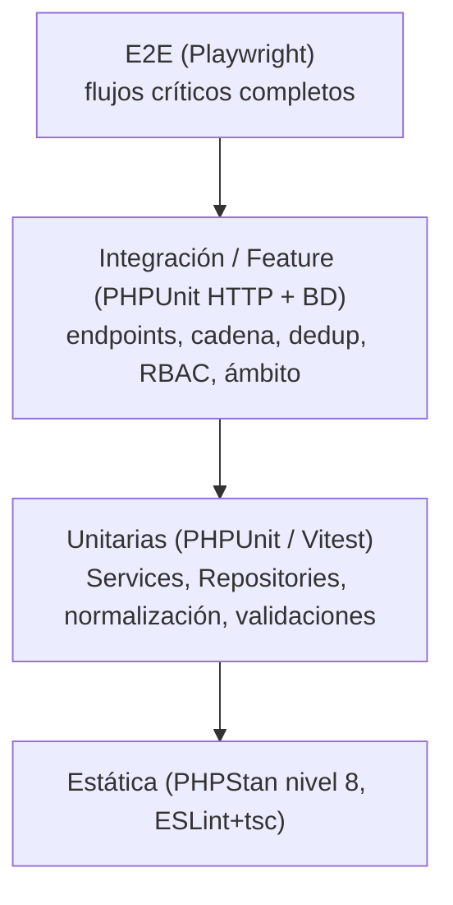

# 06 · Plan de Pruebas

| | |
|---|---|
| **Documento** | 06 — Plan de Pruebas |
| **Versión** | 1.0 |
| **Fecha** | 22 de junio de 2026 |
| **Frameworks** | PHPUnit (backend CI4), Vitest + Testing Library (SPA), Playwright (E2E), PHPStan/ESLint+tsc (estática) |
| **Cobertura objetivo** | ≥80% en Services/Repositories del backend; 100% de los RF críticos y de la máquina de estados |
| **Depende de** | [SRS (01)](../01-vision/01_SRS_especificacion_requisitos.md), [Modelo de Datos (03)](../03-datos/03_modelo_de_datos.md), [Plan de Seguridad (04)](../04-seguridad/04_plan_de_seguridad.md), [API (05)](../05-api/05_especificacion_api.md) |

---

## 1. Estrategia

| Tipo | Herramienta | Qué cubre |
|---|---|---|
| Estática | PHPStan 8 · ESLint+tsc | Tipos, contratos, mass-assignment evidente, dead code |
| Unitaria | PHPUnit · Vitest | `DeduplicacionService` (normalización, clave, score), validaciones, lógica de semáforo, componentes React |
| Integración/Feature | PHPUnit (HTTP + BD de pruebas) | Endpoints, cadena referencial, RBAC, filtrado por institución, transacciones |
| E2E | Playwright | Login→captura→validación→tablero; resolución de cola de duplicados |
| Seguridad | PHPUnit (casos negativos) | IDOR, escalada, token inválido, inyección, mass-assignment |
| Migración | Script + PHPUnit | Conciliación de cifras contra la línea base |

### 1.2 Entornos y datos de prueba
- **BD aislada de pruebas** (MySQL dedicado o esquema `*_test`); cada test corre en una transacción que se revierte (`DatabaseTestTrait` con `$refresh = true`).
- **Seeders** generan catálogos mínimos (ejes/líneas/componentes/instituciones/actividades con P/E/R y casos A–D) y usuarios de cada rol con ámbitos distintos.
- **Sin servicios externos en pruebas:** las evidencias se validan como URL (formato), no se accede a Drive; los correos van a un transporte de prueba; la cola corre síncrona.

---

## 2. Pruebas por módulo

### 2.1 Autenticación y RBAC

| Caso | Entrada | Resultado esperado |
|---|---|---|
| Login válido | credenciales correctas | 200 + token + ámbito |
| Login inválido | contraseña incorrecta | 401 |
| Fuerza bruta | 6 intentos/min | 429 al 6.º |
| Token ausente | request sin `Authorization` | 401 |
| Token revocado | logout y reusar token | 401 |
| Capturista a endpoint de coordinación | `POST /catalogos/actividades` | 403 |

### 2.2 Cadena referencial (integridad)

| Caso | Entrada | Resultado esperado |
|---|---|---|
| Ejecución sin evento | `id_evento_programado` inexistente | 422; no se crea (RN-001) |
| Participación sin ejecución | `id_ejecucion` inexistente | 422 (RN-002) |
| Agregada sin ejecución | id inválido | 422 (RN-003) |
| Compromiso sin proceso incidencia | sin `id_proceso_incidencia` | 422 (RN-004) |
| Borrar evento con ejecuciones | DELETE padre con hijos | 409/restricción FK (RN-005) |
| Producto sobre actividad P | `id_actividad` tipo P | 422 (RN-020) |
| Ejecución sobre actividad E | actividad tipo E | 422 (RN-021) |

### 2.3 Máquina de estados de `control_registro` (exhaustiva)

Tabla completa de transiciones válidas e inválidas. Una transición no listada como válida debe ser **rechazada** (409).

| Origen | Acción | Actor | Destino | ¿Permitida? |
|---|---|---|---|:---:|
| (alta) | crear con FK válida | Capturista | CAPTURADO | ✅ |
| CAPTURADO | falta campo obligatorio | Sistema | INCOMPLETO | ✅ |
| CAPTURADO | duplicado sospechoso | Sistema | REVISAR | ✅ |
| CAPTURADO | nominal completo y único | Sistema | OK | ✅ |
| CAPTURADO | es conteo agregado | Sistema | AGREGADO | ✅ |
| INCOMPLETO | completar datos válidos | Capturista | OK | ✅ |
| INCOMPLETO | al completar surge duplicado | Sistema | REVISAR | ✅ |
| REVISAR | resolver no-duplicado/fusionar | Coordinación | OK | ✅ |
| REVISAR | pedir más datos | Coordinación | INCOMPLETO | ✅ |
| OK | reabrir por inconsistencia | Coordinación | REVISAR | ✅ |
| REVISAR → OK | **capturista** intenta validar | Capturista | — | ❌ 403 |
| OK → OK | capturista "revalida" sin cambio | Capturista | — | ❌ 409 (no-op ilegal) |
| AGREGADO → OK | mezclar agregado con nominal | cualquiera | — | ❌ 409 |
| INCOMPLETO → AGREGADO | cambiar de rama | cualquiera | — | ❌ 409 |
| (cualquiera) | transición que deje huérfano | cualquiera | — | ❌ 409 |

> Esta tabla es de cobertura obligatoria: cada fila es un test. La validación de la transición ocurre en el Service ([Arquitectura §5.3](../02-arquitectura/02_arquitectura_sistema.md)).

### 2.4 Deduplicación

| Caso | Entrada | Resultado esperado |
|---|---|---|
| Normalización de acentos | "José Pérez" vs "Jose Perez", mismos datos | misma `id_datosbeneficiario` (RF-PART-041) |
| Reuso de persona | dos participaciones misma clave | mismo `id_persona` (RF-PART-042) |
| Persona nueva | clave inédita | nuevo `PER_#####` |
| Teléfono compartido, nombre distinto | mismo tel, otra persona | `REVISAR` a cola (RN-044) |
| Sin alta manual | `POST /personas` | 404/405 (endpoint inexistente) |
| Resolver duplicado | coordinación fusiona | persona destino conserva historial; queda en `auditoria` |
| Capturista resuelve cola | `PATCH /personas/duplicados/{id}` | 403 |

### 2.5 Casos A–D y agregadas

| Caso | Entrada | Resultado esperado |
|---|---|---|
| Caso A/B sin `periodo_corte` | guardar agregada | 422 (RN-081/082) |
| Agregada en beneficiarios únicos | tablero | no se cuenta como persona (RN-070) |
| Caso C avance 0 mes intermedio | tablero metas | semáforo `CORTE_AL_CIERRE`, no rojo (RN-085) |
| Cobertura total | nominales + agregadas | etiquetada como cobertura, no personas |

### 2.6 Metas y semáforo

| Caso | Entrada | Resultado esperado |
|---|---|---|
| Avance ≥90% | meta 10, avance 9 | `VERDE` |
| Avance 75–89% | meta 10, avance 8 | `AMARILLO` |
| Avance <75% | meta 10, avance 5 | `ROJO` |
| Sin meta | meta 0 | `SIN_META` |
| Actividad tipo R | cualquier avance | `FASE_3` |
| Solo OK cuenta | participación INCOMPLETO | no suma al avance (RN-091) |

### 2.7 Seguridad — casos negativos (obligatorios)

| Control OWASP | Caso | Resultado esperado |
|---|---|---|
| A01 IDOR entre instituciones | capturista de INS_A pide ejecución de INS_B (`GET /ejecuciones/{id}`) | 403/404; no fuga datos |
| A01 listado fuera de ámbito | capturista lista participaciones | solo las de su(s) institución(es) |
| A01 escalada vertical | capturista intenta `PATCH .../tipo-registro` | 403 |
| A03 SQL injection | `colonia = "'; DROP..."` | tratado como texto; sin efecto |
| A03 XSS | nombre con `<script>` | escapado en salida; no ejecuta |
| A07 token inválido/expirado/revocado | varias variantes | 401 |
| A08 mass-assignment | enviar `id_persona`/`control_registro` en el body | ignorados (`$allowedFields`) |
| A08 manipular `control_registro` por API | capturista fuerza OK | 403/409 |

---

## 3. Pruebas de rendimiento

| Endpoint | Umbral (p95) | Escenario |
|---|---|---|
| `GET /tableros/ejecutivo` | < 2 s | datos de un año (~miles de participaciones) |
| `GET /eventos-programados` (paginado) | < 800 ms | 300+ eventos, filtros activos |
| `POST /participaciones` (con dedup) | < 500 ms | alta individual |
| `spark mel:dedup` (recálculo masivo) | en lote por cola | 1000 participaciones sin bloquear request |

Verificar ausencia de N+1 en los listados (queries con joins/eager-load; conteo de queries en pruebas de feature).

---

## 4. Pruebas de migración (conciliación con la línea base)

Tras ejecutar `spark mel:import`, los conteos deben **reproducir las cifras reales verificadas** (corte 5-jun-2026), no los KPIs inflados del Excel:

| Indicador | Debe dar (±tolerancia documentada) | Criterio |
|---|---|---|
| Participaciones nominales | ≈ 988 | `COUNT(participaciones)` |
| Personas únicas | ≈ 762 (validadas ≈ 706) | `COUNT(DISTINCT id_persona)` |
| Participaciones agregadas | ≈ 2 185 | `SUM(cantidad_participantes)` |
| Cobertura total | ≈ 3 173 | nominales + agregadas |
| Eventos programados | ≈ 279 | `COUNT(eventos_programados)` |
| Ejecuciones reales | ≈ 132 | con `fecha_ejecucion_real` |
| Actividades | 236 (174 P / 42 E / 20 R) | catálogo |
| Duplicados a cola | ≈ 220 | `control_registro = REVISAR` tras importar |

**Si tras importar un tablero muestra 1000/1000/100%, la migración trajo filas-plantilla: el test falla.** Además: cero `#REF!` migrados; descuadre 236/234 conciliado a 236; `personas` regenerada (no copiada del Excel congelado).

---

## 5. Matriz de trazabilidad (RF → casos de prueba)

| Requisito | Sección de pruebas |
|---|---|
| RF-AUTH-001…005 | 2.1 |
| RF-CAT-010/013 | 2.1, 2.7 (escalada) |
| RF-PROG/EJEC (cadena) | 2.2, 2.3 |
| RF-PART-040…046 | 2.2, 2.4, 2.3 |
| RF-AGRE-050…053 | 2.5 |
| RF-PART-043/044 | 2.4 |
| RF-PROD-060…062 | 2.2 |
| RF-META-070…072 | 2.6 |
| RF-INC-080/081 | 2.2 |
| RF-VERT-090/091 | feature por endpoint (§9 API) |
| RF-RES-100 | feature por endpoint |
| RF-GOB-112 (auditoría) | aserción de `auditoria` en cada escritura |
| RNF seguridad | 2.7 |
| RNF integridad / calidad | 2.2, 4 |

---

## 6. Criterios de aceptación de calidad para release

- [ ] PHPStan nivel 8 sin errores; ESLint + `tsc` sin errores ni `any` injustificados.
- [ ] Cobertura ≥80% en Services/Repositories; 100% de la tabla de máquina de estados (§2.3) y de los casos de seguridad (§2.7).
- [ ] Todas las pruebas de cadena referencial e IDOR entre instituciones pasan.
- [ ] La conciliación de migración (§4) cuadra con la línea base; ningún tablero reporta filas-plantilla.
- [ ] `composer audit` y `npm audit` sin vulnerabilidades altas/críticas.
- [ ] E2E del flujo crítico (login→captura→validación→tablero) verde en CI.
