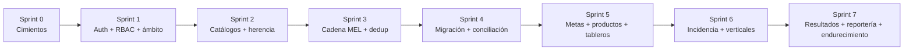

# 07 · Roadmap por Sprints

| | |
|---|---|
| **Documento** | 07 — Roadmap por Sprints |
| **Versión** | 1.0 |
| **Fecha** | 22 de junio de 2026 |
| **Cadencia** | Sprints de 2 semanas (desarrollo en solitario con apoyo de IA; ajustable) |
| **Depende de** | [SRS (01)](../01-vision/01_SRS_especificacion_requisitos.md), [Arquitectura (02)](../02-arquitectura/02_arquitectura_sistema.md), [Modelo de Datos (03)](../03-datos/03_modelo_de_datos.md), [Seguridad (04)](../04-seguridad/04_plan_de_seguridad.md), [Pruebas (06)](../06-pruebas/06_plan_de_pruebas.md) |

---

## 1. Principio de orden seguro

Los cimientos de seguridad e integridad se construyen **antes** que las funcionalidades de negocio. No se captura PII de beneficiarios sin que la autenticación, el RBAC y el filtrado por institución estén en su lugar; no se registra la cadena MEL sin las FK reales que la sostienen. La razón es directa: las tres fallas críticas del Excel (KPIs inflados, integridad frágil, protección inactiva) eran fallas de cimientos, y este sistema existe para eliminarlas por construcción. La Fase 1 sola entrega ~80% del valor porque convierte un sistema que reporta cifras falsas en uno confiable y auditable.

Mapa a las fases del análisis: **Fase 1** = Sprints 0–4; **Fase 2** = Sprint 5; **Fase 3** = Sprint 6; **Fase 4** = Sprint 7.

---

## 2. Sprints

### Sprint 0 — Cimientos
**Objetivo:** un monorepo funcional con entornos, esquema base y pipeline de calidad, desplegable a staging.

- Monorepo `apps/api` (CI4 4.7) + `apps/web` (React 19/Vite); `docker-compose` con MySQL 8 + Redis.
- Migraciones base del esquema (doc 03): dimensiones + gobernanza; `php spark migrate`.
- CI/CD base: PHPStan nivel 8, ESLint+tsc, PHPUnit/Vitest en pipeline.
- Hardening de staging (doc 04 §6.3): HTTPS, cabeceras, CORS, `production`.
- Pruebas: arranque del entorno, migración reproducible desde cero.
- Referencia: [ADR-001](../02-arquitectura/ADR/ADR-001_stack-ci4-react-mysql.md), Arquitectura §6.

**Hito:** `git clone` → `docker compose up` → migraciones → SPA y API responden en staging con HTTPS y estática verde.

### Sprint 1 — Autenticación, RBAC y segmentación
**Objetivo:** acceso seguro por cuenta individual, rol y ámbito de institución.

- Instalar y configurar Shield (`shield:setup`); grupos `capturista/coordinacion/direccion/administrador`.
- `usuarios`, `roles`, `usuario_institucion`; seeder de admin inicial.
- Filtros `auth`, `rbac`, `scope-institucion`, `throttle`; `PolicyService` base.
- Login/logout/me en la SPA; manejo de token en memoria.
- Pruebas: doc 06 §2.1 y §2.7 (token inválido, escalada, IDOR base).
- Referencia: [ADR-002](../02-arquitectura/ADR/ADR-002_autenticacion-shield.md), [ADR-004](../02-arquitectura/ADR/ADR-004_segmentacion-institucion.md), Seguridad §A01/A07.

**Hito:** un capturista entra con su cuenta, solo ve su ámbito; un intento de acción de coordinación devuelve 403; las pruebas de IDOR pasan.

### Sprint 2 — Catálogos y herencia estratégica
**Objetivo:** la verdad estratégica vive en los catálogos y se hereda.

- CRUD de ejes/líneas/componentes/instituciones/actividades (escritura coordinación/admin).
- Carga de las 236 actividades con `tipo_registro` (P/E/R) y `caso_excepcional` (A–D).
- Resolución de herencia (eje→línea→componente→institución) en solo lectura.
- Pruebas: herencia correcta; capturista no edita catálogos; conteo 236 (174/42/20).
- Referencia: SRS §3.2, Glosario.

**Hito:** al elegir una actividad, el formulario muestra la herencia en solo lectura; reclasificar P/E exige coordinación y queda en auditoría.

### Sprint 3 — Cadena MEL (núcleo) + deduplicación
**Objetivo:** capturar la cadena completa con integridad y dedup en servidor.

- Procesos, eventos programados, ejecuciones, participaciones, agregadas (FK reales, `ON DELETE RESTRICT`).
- Máquina de estados de `control_registro` validada en Service.
- `DeduplicacionService` (normalización, clave, asignación de `id_persona`, score, cola).
- `personas` derivada; cola de revisión (coordinación).
- Pruebas: doc 06 §2.2, §2.3 (exhaustiva), §2.4.
- Referencia: [ADR-003](../02-arquitectura/ADR/ADR-003_deduplicacion-sin-postgres.md), Arquitectura §4.1/§5.

**Hito:** es imposible crear huérfanos o un producto sobre actividad no-E; los duplicados sospechosos van a cola y coordinación los resuelve con traza.

### Sprint 4 — Migración y conciliación
**Objetivo:** arrancar con los datos reales del Excel, saneados.

- `spark mel:import`: exportar CSV, filtrar filas-plantilla, limpiar `#REF!`, conciliar 236/234, cargar en orden de dependencias, re-deduplicar.
- Cola inicial con los ~220 duplicados marcados.
- Pruebas: doc 06 §4 (conciliación con la línea base).
- Referencia: doc 03, Pruebas §4.

**Hito:** los conteos post-migración cuadran con la línea base (≈988/762/279/132); ningún tablero muestra 1000/100%. **Fin de Fase 1.**

### Sprint 5 — Metas, productos y tableros
**Objetivo:** seguimiento POA y KPIs reales.

- Metas anuales y mensuales (M01–M18); `vw_seguimiento_metas` con semáforo y lógica C/D.
- Productos/entregables (rama tipo E).
- Tableros operativo, coordinación, ejecutivo, analítico (vistas, `control_registro = OK`).
- Pruebas: doc 06 §2.5, §2.6; rendimiento de tableros (§3).
- Referencia: SRS §3.7/§3.8/§3.13, doc 03 vistas.

**Hito:** el semáforo refleja avance real; los tableros muestran cifras reales y responden en tiempo interactivo. **Fin de Fase 2.**

### Sprint 6 — Incidencia y verticales
**Objetivo:** subsistemas verticales en producción.

- Incidencia: propuestas, procesos, compromisos (FK a proceso), alianzas, hitos.
- Ocupación shelter (% calculado) y sostenibilidad financiera (utilidad, acumulados, semáforo).
- Pruebas: dependencia de proceso (RN-004); cálculos verticales.
- Referencia: SRS §3.9/§3.10, doc 03 §3.5/§3.6.

**Hito:** incidencia y verticales capturan y reportan correctamente. **Fin de Fase 3.**

### Sprint 7 — Resultados, reportería y endurecimiento
**Objetivo:** madurez MEL y lanzamiento.

- Capa de resultados (tipo R): indicador, línea base, valor, método, evidencia.
- Reportería/exportación para FECHAC; conector BI documentado (modelo estrella sobre MySQL).
- Alertas de plazos (día 20, lunes siguiente) — opcional.
- Auditoría de seguridad final, observabilidad (logs), respaldos verificados, checklist de producción.
- Pruebas: regresión completa, E2E, `composer/npm audit`.
- Referencia: SRS §3.11/§3.14, Seguridad §4, Arquitectura §6.3.

**Hito:** se puede medir resultado (R) y exportar a financiador; checklist de producción completo; lanzamiento. **Fin de Fase 4.**

---

## 3. Riesgos y mitigaciones

| Riesgo | Probabilidad | Impacto | Mitigación | Sprint |
|---|---|---|---|---|
| Fuga horizontal entre instituciones (sin RLS) | Media | Alto | Filtro centralizado en Repository + pruebas IDOR obligatorias | 1, continuo |
| Calidad de datos heredados (220 duplicados, `#REF!`) | Alta | Medio | Limpieza en migración + cola de revisión continua | 4 |
| Resistencia al cambio de capturistas | Media | Medio | UI más simple que Excel; capacitación; correr en paralelo un periodo | 5–7 |
| Deduplicación con falsos positivos/negativos | Media | Medio | Clave determinista + score como sugerencia; nunca autofusión | 3 |
| Ciclo POA de 18 meses sin confirmar | Media | Medio | Parametrizar inicio/fin del ciclo; confirmar con coordinación (D-03) | 5 |
| Enlaces de evidencia rotos en Drive | Media | Bajo | Validación periódica de enlaces; marca "no accesible" | 5, continuo |
| Desarrollo en solitario (continuidad) | Media | Medio | Documentación viva + esquema versionado desde Sprint 0 | continuo |
| Rendimiento de tableros al crecer | Baja | Medio | Vistas indexadas + tabla-resumen por cola si el volumen lo exige | 5 |

---

## 4. Backlog post-MVP

Confirmado para versiones futuras (ver [SRS §8](../01-vision/01_SRS_especificacion_requisitos.md)):

- App móvil nativa y/o captura offline (PWA).
- Alojamiento de archivos de evidencia en la plataforma (dejar de depender de Drive).
- *Fuzzy matching* avanzado de personas más allá de la clave determinista.
- Verificación de identidad de beneficiarios.
- Alertas automáticas avanzadas y configurables por rol.
- Reportes parametrizables por más financiadores.
- Estructuración del "Aprendizaje" (lecciones) como dato, no solo narrativa.
