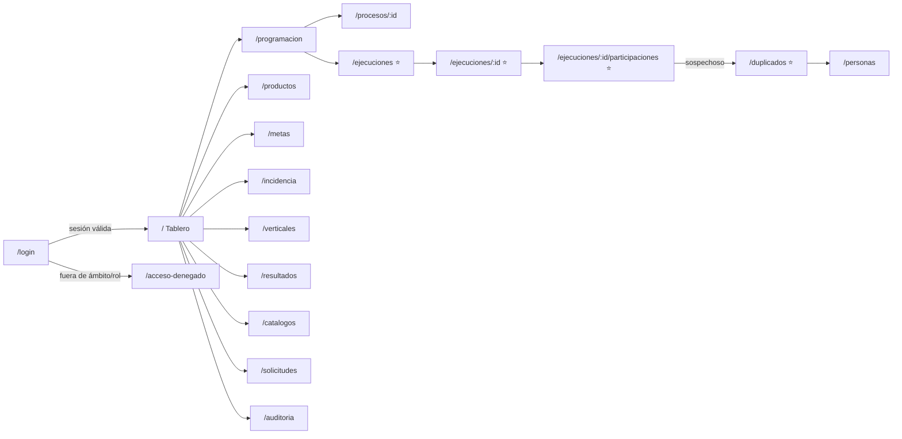

# 09 — Guía del Demo UI/UX

| Campo | Valor |
|---|---|
| **Documento** | 09 — Guía del Demo UI/UX (Fase 1 · Demo-First v2) |
| **Versión** | 1.0 |
| **Fecha** | 23/06/2026 |
| **Producto** | Sistema MEL — Plataforma de Monitoreo, Evaluación y Aprendizaje (CPJ) |
| **Stack del demo** | React 19 · Vite 6 · TypeScript 5 · Tailwind CSS 4 · `lucide-react` · React Router 7 · TanStack Query 5 |
| **Ubicación del código** | [`app/`](app/) |
| **Origen de datos** | `app/src/lib/mock/db.json` (espejo exacto del DDL) detrás de `app/src/lib/api.ts` |
| **Depende de** | [01 — SRS](../01-vision/01_SRS_especificacion_requisitos.md) · [03 — Modelo de Datos](../03-datos/03_modelo_de_datos.md) · [05 — API](../05-api/05_especificacion_api.md) · [08 — Design System](../01-vision/08_identidad_visual_design_system.md) · [Metodología Demo-First v2](../../Metodología%20Demo-First/METODOLOGIA_DEMO_FIRST_v2.md) |

> Este documento es el **contrato de la Fase 1**. Define qué valida el demo, qué pantallas existen, qué estados cubre cada componente, cómo el `db.json` refleja el DDL y cómo se valida con el stakeholder. Un agente desarrollador debe poder, leyendo este documento y el código de `app/`, **completar y promover** el demo a `apps/web/` sin ambigüedad. El estado actual entregado son los **fundamentos** (capa `lib/` + `db.json` + esta guía); el inventario de pantallas describe el destino completo de la Fase 1.

---

## 1. Propósito y alcance

El demo es el **esqueleto del frontend de producción**, no una maqueta desechable. Cubre la cadena MEL de extremo a extremo desde la perspectiva de los cuatro roles, y permite recorrer cada flujo del SRS antes de construir el backend CI4. Al llegar la Fase 2, solo se sustituye el origen de datos (JSON → API real) rellenando `api.real.ts`; las pantallas no se reescriben.

**Declaración de datos:** todo dato es **simulado**, vive solo en `db.json`, **no se persiste** nada (las escrituras solo viven en memoria durante la sesión del navegador y se reinician al recargar) y **no contiene PII real** (correos `@demo.test`, teléfonos y nombres inventados). Esto preserva el "orden seguro" de la metodología: el demo no captura datos reales ni expone superficie de ataque.

**Qué valida el demo:**

- La **cadena referencial** completa: proceso → evento programado → ejecución → participación → persona, con la imposibilidad de crear hijos huérfanos (RN-001…005).
- La **deduplicación determinista**: cálculo de `id_datosbeneficiario` en el adaptador (espejo del servidor), asignación de `id_persona`, consolidación de variantes (José/Jose) y envío de sospechosos a la **cola de revisión**.
- La **máquina de estados** de `control_registro` (CAPTURADO → INCOMPLETO/REVISAR/OK/AGREGADO) con las transiciones legales y el candado REVISAR→OK exclusivo de coordinación.
- La **herencia estratégica** en solo lectura (eje/línea/componente/institución) al elegir una actividad (RF-CAT-011).
- El **seguimiento de metas** con semáforo en vivo y la lógica de casos C/D (corte al cierre, no rojo).
- El **control de acceso** por rol y por **ámbito de institución** a nivel de presentación (un capturista no ve otra institución).
- Las **mejores prácticas UI/UX**: todos los estados de cada componente, accesibilidad WCAG 2.1 AA, responsive y navegación por teclado.

**Fuera del demo:** seguridad real (tokens Shield, RBAC y filtrado por institución en servidor), cálculo en servidor, persistencia en MySQL, deduplicación con la clave real del backend. Todo eso es Fase 2 (backend). El demo *simula* el comportamiento server-side en el adaptador mock (`api.mock.ts`) para que la UX sea fiel al contrato del doc 05.

---

## 2. Inventario de pantallas

Todas las rutas privadas viven bajo el `AppShell` (exige sesión). El rol indicado es **quién ve el módulo**; la escritura la revalida el backend en Fase 2 (el cliente solo oculta lo no permitido). El flujo **prioritario de esta Fase 1** es la **cadena de captura** (marcado ⭐).

| Pantalla | Ruta | Requisito(s) SRS | Roles que la ven | Archivo |
|---|---|---|---|---|
| Login | `/login` | RF-AUTH-001 | público | `pages/LoginPage.tsx` |
| Acceso denegado | `/acceso-denegado` | RF-AUTH-003/004 | público | `pages/AccesoDenegadoPage.tsx` |
| Tablero (KPIs reales) | `/` | RF-TAB-120/121 | todos | `pages/TableroPage.tsx` |
| Calendario / Programación | `/programacion` | RF-PROG-020…023 | capturista, coordinación | `pages/ProgramacionPage.tsx` |
| Proceso — alta/detalle | `/procesos/:id` | RF-PROG-020/021 | capturista, coordinación | `pages/ProcesoDetailPage.tsx` |
| ⭐ Ejecuciones (cola por estado) | `/ejecuciones` | RF-EJEC-030…033 | capturista, coordinación | `pages/EjecucionesPage.tsx` |
| ⭐ Ejecución — registro + validación | `/ejecuciones/:id` | RF-EJEC-031, SRS §4 | capturista (captura), coordinación (validar) | `pages/EjecucionDetailPage.tsx` |
| ⭐ Participaciones de una ejecución | `/ejecuciones/:id/participaciones` | RF-PART-040…046 | capturista, coordinación | `pages/ParticipacionesPage.tsx` |
| ⭐ Cola de duplicados | `/duplicados` | RF-PART-043/044 | coordinación | `pages/DuplicadosPage.tsx` |
| Personas (consolidado) | `/personas` | RF-PART-042 | coordinación | `pages/PersonasPage.tsx` |
| Productos / entregables (tipo E) | `/productos` | RF-PROD-060…062 | capturista, coordinación | `pages/ProductosPage.tsx` |
| Metas y seguimiento (semáforo) | `/metas` | RF-META-070…072 | coordinación (edita), todos (ven) | `pages/MetasPage.tsx` |
| Incidencia | `/incidencia` | RF-INC-080/081 | capturista, coordinación | `pages/IncidenciaPage.tsx` |
| Verticales (shelter / sostenibilidad) | `/verticales` | RF-VERT-090/091 | capturista, coordinación | `pages/VerticalesPage.tsx` |
| Resultados (tipo R) | `/resultados` | RF-RES-100 | coordinación | `pages/ResultadosPage.tsx` |
| Catálogos (actividades, ejes…) | `/catalogos` | RF-CAT-010…013 | coordinación, admin | `pages/CatalogosPage.tsx` |
| Solicitudes | `/solicitudes` | RF-GOB-110/111 | todos | `pages/SolicitudesPage.tsx` |
| Auditoría | `/auditoria` | RF-GOB-112 | coordinación, dirección, admin | `pages/AuditoriaPage.tsx` |
| 404 | `*` | — | público | `pages/NotFoundPage.tsx` |

---

## 3. Mapa de navegación (IA)



La navegación principal es un **panel administrativo** con nav lateral agrupada (*Captura* · *Calidad* · *Metas y resultados* · *Gobernanza*) + barra superior con indicador de "datos simulados", selector de rol/ámbito (solo demo) y menú de usuario. En móvil la nav lateral se vuelve un cajón (drawer) con overlay.

---

## 4. Catálogo de estados por componente

La biblioteca vive en `app/src/components/ui/` (basada en el doc 08) y `app/src/components/layout/`. Cada componente expone explícitamente sus estados (Definición de Hecho, Demo-First v2 §7): `default / hover / focus / disabled / loading / empty / error`.

| Componente | Archivo | Estados / variantes cubiertos |
|---|---|---|
| Button | `ui/Button.tsx` | primario, secundario, peligro, ghost · default/hover/focus/disabled/loading |
| TextField | `ui/TextField.tsx` | default/focus/disabled/error · con mensaje accionable (RNF-031) |
| Select | `ui/Select.tsx` | catálogo obligatorio (RNF-033) · loading/empty/error |
| StatusBadge | `ui/StatusBadge.tsx` | OK/INCOMPLETO/REVISAR/AGREGADO/CAPTURADO (máquina de estados) |
| SemaforoBadge | `ui/SemaforoBadge.tsx` | VERDE/AMARILLO/ROJO/SIN_META/CORTE_AL_CIERRE/FASE_3 |
| RoleBadge | `ui/RoleBadge.tsx` | capturista/coordinación/dirección/administrador |
| DataTable | `ui/DataTable.tsx` | loading (skeleton) / empty / error / con datos · paginada |
| HerenciaPanel | `ui/HerenciaPanel.tsx` | solo lectura: eje→línea→componente→institución (RF-CAT-011) |
| KpiCard | `ui/KpiCard.tsx` | loading/valor/empty · para el tablero |
| Modal | `ui/Modal.tsx` | abierto/cerrado · foco atrapado, cierre con Esc |
| EmptyState / ErrorState | `ui/EmptyState.tsx`, `ui/ErrorState.tsx` | cola vacía, sin permiso, error de carga (con reintento) |
| Toast | `ui/Toast.tsx` | éxito/error/info |
| AppShell / Sidebar / Topbar | `layout/*` | nav agrupada · drawer móvil · indicador de datos simulados |

---

## 5. Espejo de datos (`db.json` ↔ DDL)

El `db.json` (`app/src/lib/mock/db.json`) es un **espejo exacto del DDL del doc 03**. Reglas de fidelidad aplicadas y verificadas (`validate_mel_db.py`, 0 errores):

- **Una clave de nivel superior por tabla** del DDL — 27/27 tablas presentes (núcleo, metas, incidencia, verticales, gobernanza).
- **Columnas, enums y nullabilidad exactas**: fechas `YYYY-MM-DD`, datetime `YYYY-MM-DD HH:MM:SS(.uuuuuu)`, booleanos `true/false`, JSON (`auditoria.valor_*`) como objetos, enums solo con valores válidos.
- **CHECKs respetados**: `fecha_finalizacion ≥ fecha_inicio`, `anio_nacimiento ∈ [1900,2026]`, cantidades `≥ 0`.
- **Integridad referencial total**: cada FK apunta a un id existente; las FK nullable (`id_proceso`, `id_persona`, `responsable_atencion`) admiten `null`.
- **`personas` deriva de participaciones**, no se da de alta manual (RF-PART-044): no hay método de creación de personas en el contrato.
- **Cero PII**: dominios `@demo.test`, sin datos reales (LFPDPPP — restricción técnica del SRS §6).

**Capa de acceso (la pieza que se congela).** Las pantallas nunca leen `db.json`; piden a `api.*`:

```
app/src/lib/
├── types.ts       ← tipos espejo del doc 03 + inputs/respuestas del doc 05
├── api.ts         ← INTERFAZ ApiClient (un método por endpoint doc 05) — SE CONGELA
├── api.mock.ts    ← implementación mock: dedup, máquina de estados, KPIs sobre "vistas"
├── api.real.ts    ← implementación real (stub; se rellena en Fase 2 con axios)
├── index.ts       ← interruptor VITE_USE_MOCK (mock por defecto)
└── mock/
    ├── db.json    ← ESPEJO EXACTO del DDL con datos de prueba
    └── query.ts   ← helper mínimo (clonar/filtrar/paginar/normalizar)
```

**Comportamiento server-side simulado en `api.mock.ts`** (para que el contrato sea fiel desde el demo):

- `calcularClaveDedup()` — normaliza acentos/espacios y rellena a `CHAR(40)`, espejo de la colación `utf8mb4_0900_ai_ci` + normalización en PHP (RF-PART-041).
- Estados calculados en servidor: una ejecución sin resumen/evidencia queda `INCOMPLETO`; una participación con teléfono compartido de clave distinta entra a `REVISAR`.
- Bloqueos de regla: tipo E rechazado en ejecuciones (422), producto solo sobre tipo E (422), evento multisesión sin proceso (422), fechas invertidas (422), evento cancelado sin ejecución (409), `periodo_corte` obligatorio en casos A/B (422).
- Tableros como **vistas en vivo**: `beneficiarios_unicos` = personas `OK` distintas; KPIs jamás sobre filas-plantilla (RF-TAB-120).

**Doble uso (Fase 2):** el mismo `db.json` siembra MySQL vía `insertBatch` en el `InitialSeeder` de CI4 — los datos validados en el demo y los de prueba del backend (doc 06) son la misma fuente.

### 5.1 Casos QA sembrados en `_demo.casos_qa`

| Caso | Qué valida | Datos |
|---|---|---|
| QA1 | Cadena referencial e imposibilidad de huérfanos | PROC 1 → EVP 88/89 → EJEC 132 → PAR 988/989/990 |
| QA2 | Dedup consolida variantes (José/Jose, mismo tel.) | PAR 988 y 990 comparten `PER_00762` y clave |
| QA3 | Cola de revisión por sospecha | PAR 991 → `REVISAR`, sugiere `PER_00120`, score 0.94 |
| QA4 | Estado INCOMPLETO no cuenta en KPIs | EJEC 133 sin resumen/evidencia |
| QA5 | Bloqueo de tipo E en ejecución | ACT_048 (E) ausente del formulario de ejecución |
| QA6 | Caso C/D sin falso rezago | ACT_094 (C) avance 0 en M06 → `CORTE_AL_CIERRE` |
| QA7 | Segmentación por institución | usuario 12 (capturista) solo ve `INS_00002` |

---

## 6. Accesibilidad — WCAG 2.1 AA

Verificada contra el doc 08. Obligatorio en cada componente y pantalla:

- **Contraste** texto/fondo ≥ 4.5:1 (≥ 3:1 en texto grande y bordes de control), usando los tokens de color verificados del doc 08.
- **Navegación por teclado** completa con orden lógico y **focus visible** (anillo de foco, nunca `outline:none` sin reemplazo).
- **HTML semántico** + ARIA donde aplique: `label`/`for` en todo campo, `aria-invalid` y `aria-describedby` en errores, `role="status"`/`aria-live` en toasts y resultados de validación, `aria-current` en la nav.
- **Estados no solo por color**: el semáforo y `control_registro` llevan icono/texto además del color (daltonismo).
- **Targets táctiles** ≥ 44×44 px; **idioma** `lang="es"` (RNF-034).
- Mensajes de error **en el momento**, claros y accionables (RNF-031), nunca un genérico "campo inválido".

---

## 7. Responsive

Mobile-first, con los breakpoints del doc 08:

- **Móvil (< 640px):** nav lateral → drawer; tablas → tarjetas apiladas; formularios de captura a una columna; barra de acciones fija inferior.
- **Tablet (640–1024px):** nav colapsable; tablas con scroll horizontal controlado; formularios a dos columnas.
- **Escritorio (> 1024px):** nav lateral fija; tablas completas; detalle de ejecución con panel lateral de participaciones.
- Sin desbordes horizontales; los KPIs del tablero reflujan en grid responsiva.

---

## 8. Protocolo de validación con stakeholder

Sesión con Coordinación MEL (dueña del producto) recorriendo el demo **sin backend**, en este orden:

1. **Login por rol** (capturista / coordinación / dirección) y verificación del ámbito (QA7).
2. **Cadena de captura ⭐**: programar evento → registrar ejecución → capturar 3 participaciones → ver una caer a INCOMPLETO y otra a REVISAR (QA1, QA3, QA4).
3. **Dedup**: capturar "Jose Perez" sin acento y confirmar que consolida con "José Pérez" (QA2); resolver el duplicado de la cola como coordinación.
4. **Bloqueos de regla**: intentar ejecutar una actividad tipo E (QA5); crear un producto sobre una tipo P.
5. **Metas**: ver el semáforo y confirmar que ACT_094 (caso C) muestra "corte al cierre", no rojo (QA6).
6. **Tablero**: confirmar que los KPIs cuadran con los registros OK y que ningún número es 100%/1000 (RF-TAB-120).
7. **Gobernanza**: registrar una solicitud, resolverla como coordinación, ver el rastro en auditoría.

**Criterio de la sesión:** el stakeholder recorre cada flujo crítico sin asistencia; cada hallazgo se anota en la bitácora (§9). Al cierre se **re-sincronizan SRS(01) y API(05)** y se marca el contrato del API como **CONGELADO**.

### 8.1 Definición de Hecho del demo (Demo-First v2)

- [ ] Cada flujo crítico del SRS navegable de extremo a extremo.
- [ ] Cada componente con estados default/hover/focus/disabled/loading/**empty/error**.
- [ ] Navegación por teclado con focus visible; ARIA + HTML semántico; **WCAG 2.1 AA** verificado contra doc 08.
- [ ] Responsive en todos los breakpoints.
- [ ] Mock detrás de `lib/api.ts`; pantallas nunca leen `db.json`.
- [ ] `db.json` cubre escenarios vacío/error/sin-permiso (no solo el camino feliz) y valida contra el DDL del doc 03. **(✅ validado: 0 errores)**
- [ ] `typecheck` + `lint` verdes + smoke E2E del flujo de captura.
- [ ] Sesión de validación con bitácora hallazgos→cambios.
- [ ] SRS(01) y API(05) re-sincronizados y contrato del API marcado **CONGELADO**.

---

## 9. Bitácora hallazgos → cambios

Se completa durante y después de la sesión de validación. Un renglón por hallazgo.

| # | Fecha | Pantalla / flujo | Hallazgo del stakeholder | Cambio aplicado | Afecta doc | Estado |
|---|---|---|---|---|---|---|
| — | — | — | (pendiente: primera sesión de validación) | — | — | — |

> Al cerrarse esta bitácora sin hallazgos abiertos y con la Definición de Hecho completa, la Fase 1 termina y arranca la Fase 2 (backend CI4) contra el contrato congelado.

---

## 10. Cómo correr el demo (Fase 2 pendiente del scaffold)

> El scaffold Vite/React (package.json, vite.config, tsconfig, tailwind, `main.tsx`, componentes y pantallas) es el **siguiente entregable**. Una vez presente:

```bash
cd demo-ux/app
npm install
npm run dev          # arranca con VITE_USE_MOCK=true (db.json)
```

Promoción a producción (Fase 2): mover `demo-ux/app/` → `apps/web/`; `VITE_USE_MOCK=false`; sembrar MySQL con `db.json`; rellenar `api.real.ts`; borrar `api.mock.ts` y `mock/`. **Las pantallas no se tocan.**
